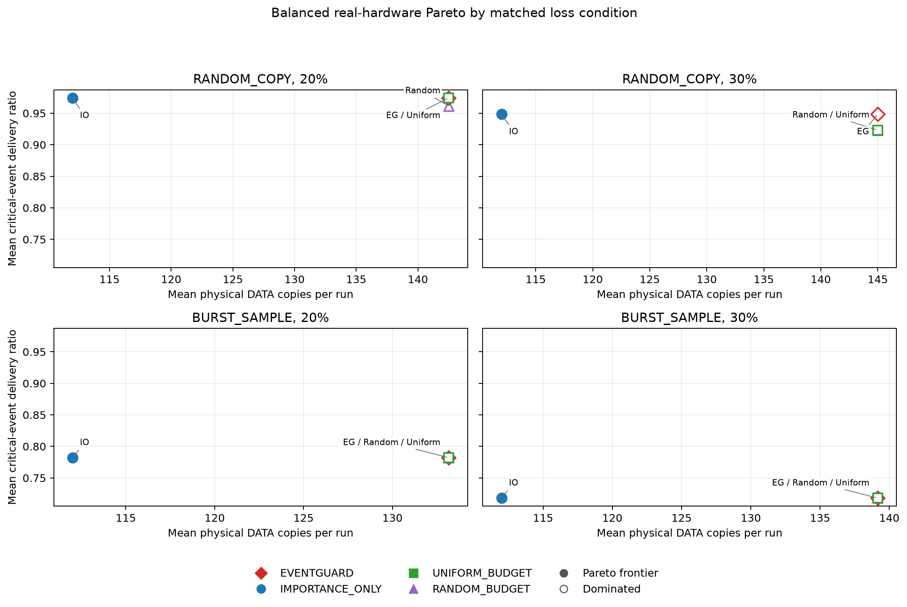

# EventGuard-LoRa

EventGuard-LoRa is a research prototype for measuring critical-event delivery against communication cost on a constrained Sub-GHz link. The frozen v1 policy has both host-simulation results and a **post-hoc balanced analysis of 96 completed hardware runs** from two ESP32-S3 boards with E220-400T22D radios. The 300 E220 runs below are an older, separate pilot and do not validate v1.

**Status: v1.0 research prototype complete.** The current v1 evaluation is complete. Future work should focus on real RF channel experiments rather than extending the interrupted 160-run application-layer matrix.

## Key Results

- **Hardware:** 96 real-device runs on two ESP32-S3 boards with E220-400T22D radios; four strategies (`EVENTGUARD`, `IMPORTANCE_ONLY`, `UNIFORM_BUDGET`, `RANDOM_BUDGET`).
- **Conditions:** `RANDOM_COPY` and `BURST_SAMPLE` at 20% and 30% software-injected loss, paired seeds 31–36. This is a post-hoc balanced analysis of the completed Stage 1 prefix; the six-seed sample size was not preregistered.
- **Integrity:** offline audit **96/96 PASS**. `IMPORTANCE_ONLY` matched `EVENTGUARD` critical-event delivery in every selected paired run while using fewer DATA copies and bytes.
- **Equal budget:** `EVENTGUARD` directed a larger share of copies to critical events than the event-blind baselines; observed delivery gains were small and limited to some `RANDOM_COPY` conditions.
- **Open anomaly:** the later seed-37 run103 receive-path stall and its raw evidence remain preserved; its cause is not claimed to be resolved.



## Research Question

At an exact DATA-copy budget under the same trace realization and channel calendar within each paired seed, does adapting redundancy to event importance and link state deliver more critical events than budget-matched policies?

## Motivation

Periodic sensor traffic often treats every sample equally. EventGuard assigns each sample a transparent three-level importance score and spends a bounded number of packet copies on important events. This repository makes the comparison reproducible and keeps application-layer fault injection distinct from errors caused by the physical radio channel.

## System Model

The Sensor Node replays a deterministic trace (or optionally samples real sensors), classifies importance, selects bounded redundancy, and sends compact CRC-protected binary frames through an E220 UART. The Gateway validates frames, deduplicates logical samples, records physical copies, and returns ACK frames. A host runner configures both ESP32-S3 boards, captures machine-readable serial logs, and computes metrics.

```text
Python reference trace ──serial control──> Sensor ESP32-S3 ──E220──> Gateway ESP32-S3
        │                                      ▲                   │
        └── shared run manifest                └────── ACK ────────┘
                       host parser / metrics / plots / report
```

## Method

Importance uses normalized change, rate, baseline deviation, co-change, persistence, and a directional hazard-level rule. The [frozen algorithm specification](docs/algorithm_spec_v1.md) records exact equations, thresholds, window behavior, and source hashes. The benchmark trace has a strict 10 s interval. NORMAL, IMPORTANT, and CRITICAL map to 1, 2, and 3 copies on a good link. Link state uses a sliding window of **first-copy accepted ACK outcomes** and consecutive first-copy failures; this avoids strategy-dependent observation bias. All physical copy attempts, ACK successes, and failures are counted separately. Thresholds and radio timing are in `configs/default.json`.

## Baselines

- `NO_PROTECTION`: one DATA copy.
- `FIXED_REDUNDANCY`: the same configured copy count for every sample (default 2).
- `EVENTGUARD`: importance- and link-aware copies, capped at 3 by default.
- `FIXED_1`, `FIXED_2`, `FIXED_3`: one, two, or three copies for every sample. `FIXED_1` equals `NO_PROTECTION`.
- `IMPORTANCE_ONLY`: 1/2/3 copies from predicted importance, without link state.
- `LINK_ONLY`: 1/2/3 copies from link state, without importance.
- `UNIFORM_BUDGET`, `RANDOM_BUDGET`: exactly match EventGuard’s total DATA-copy count for each model/rate/seed/trace. Extra copies use round-robin or seeded hash order and do not read event labels or sensor values.

## Experimental Protocol

The host reference experiment uses identical trace rows and deterministic loss plans keyed by seed, frame kind, logical sequence, and copy index. `RANDOM_COPY` uses independent keyed decisions. `BURST_COPY` erases contiguous canonical copy opportunities. `BURST_SAMPLE` erases every copy opportunity in contiguous logical samples; this is the main burst model. DATA and ACK calendars are independent. Fairness audits report effective DATA/ACK drops and first-copy drops. The physical runner sends actual E220 frames and applies deterministic application-layer drops after reception; injected loss is not measured RF loss.

`python tools/run_all_experiments.py --simulate` runs the isolated 8,000-run pre-hardware evaluation (8 strategies × 5 rates × 2 models × 100 evaluation seeds) and writes `results/pre_hardware_v1/` plus `results/pre_hardware_validation.md`. Seeds 1–30 are reserved for calibration; seeds 31–130 are used only for evaluation. `python tools/run_research_analysis.py` verifies the frozen code hashes, analyzes the locked 8,000 runs, and adds 11,000 host-only sensitivity runs. All experiments save a JSON manifest.

The completed hardware data are in `results/hardware_validation_v2_policy_v2/`. `FINAL_BALANCED_HARDWARE_SET_V1` is a post-hoc balanced primary analysis of the interrupted 160-run Stage 1 experiment: seeds 31–36, four strategies, RANDOM_COPY and BURST_SAMPLE, 20% and 30% loss, 96 completed runs total. The six seeds are the earliest contiguous seeds with complete coverage in execution order, selected by completeness rather than outcome; `n=6` was not a preregistered sample size. There are six deterministic 54-sample trace realizations, one per paired seed, shared across strategies within each seed; seed-dependent sensor noise makes their trace hashes differ. Each run preserves raw Sensor/Gateway logs, run manifest, firmware hashes, END counters, UART diagnostics, and execution order. To repeat the offline audit and regenerate final statistics and plots, run `.venv/bin/python tools/finalize_hardware_dataset.py`; this does not contact hardware.

## Hardware

- Two ESP32-S3 boards connected over USB at the same time.
- Sensor: E220-400T22D, SHT30, BH1750, capacitive soil sensor, optional OLED.
- Gateway: ESP32-S3 and E220-400T22D.
- ESP-IDF v5.4.4; native IDF UART driver; no Arduino framework.

Verified E220 profile: UART1 at 9600 baud; TX/RX/AUX GPIO 17/16/15; M0/M1 GPIO 13/14; address `0x0000`; REG0 `0x62`; channel register `0x17` (decimal 23). Firmware reads these settings on boot and fails radio readiness if they differ; it does not write module configuration. The two detected board MACs were Sensor `80:65:99:a7:a8:a4` and Gateway `c0:4e:30:31:42:9c`.

The Sensor trace replay is the benchmark default. `REAL_SENSOR_MODE` is a separate demonstration mode; sensor drivers are isolated and are not used to generate benchmark results.

## Automation Pipeline

`tools/run_all_experiments.py` identifies the two serial roles from `STATUS` responses or existing `TX`/`RX` identity logs, records chip MACs, builds and flashes the two firmware roles, streams the seed-specific trace realization to each paired run, captures raw serial logs, and invokes analysis. Role assignment is based on observed firmware output; the host never asks the user to swap ports.

The original physical pilot outputs remain under `results/raw/`, `results/runs/`, `results/metrics/`, `results/plots/`, `summary.csv`, `summary.json`, and `report.md`. New host outputs are isolated in `results/pre_hardware_v1/`.

## Simulation Results

### Pre-hardware validation v1

The corrected host matrix completed 8,000 runs on evaluation seeds 31–130. The host test suite includes compiled C/Python parity for importance labels, copy selection, link transitions, loss decisions, and budget allocation. The Sensor and Gateway firmware compiled with ESP-IDF during PR #1; no boards were flashed or exercised in this round.

CRITICAL classifier precision is 0.8125, recall 1.0000, and F1 0.8966; NORMAL→CRITICAL false rate is 0. The synthetic trace remains simple, so these are not field-accuracy claims. EventGuard has small exact-budget gains at some RANDOM_COPY loss rates, but `IMPORTANCE_ONLY` matches its CRITICAL delivery in **every** paired host run while using no more DATA copies. Under `BURST_SAMPLE`, redundant copies do not improve DATA delivery. These host-only findings motivated the controlled hardware comparison summarized below.

Read the [diagnostic report](results/pre_hardware_validation.md), [per-run CSV](results/pre_hardware_v1/runs.csv), and [matched-budget plot](results/pre_hardware_v1/plots/critical_delivery_vs_exact_budget.png).

The expanded analysis adds [ablation statistics](results/ablation/report.md), [20 predeclared paired tests](results/ablation/paired_tests.csv), [Pareto frontiers](results/plots/pareto/pareto_frontier.png), [parameter sensitivity](results/sensitivity/report.md), and [failure cases](results/failure_analysis.md). It reports mean, median, sample standard deviation, and 95% mean CI for delivery and cost. EventGuard lies on **0 of 10** within-condition critical-delivery/byte Pareto frontiers: IMPORTANCE_ONLY or another lower-cost baseline matches its critical delivery in each tested condition. The [research status report](results/research_status_report.md) and [paper draft](docs/paper_draft.md) preserve this negative finding. The sensitivity grid tests CRITICAL threshold 2.0–4.0, link window 8/12/16/24, and copy cap 2/3. Cap 4 is explicitly unsupported by frozen v1's three-slot loss calendar and is not represented as a result.

### Final balanced v1 hardware validation

The post-hoc balanced primary analysis contains **96 real-device runs** (four strategies × two loss models × two loss rates × six paired seeds). The original Stage 1 target was 160 runs; the experiment was interrupted after run103. Seeds 31–36 are the earliest contiguous evaluation seeds completed across every condition; selection was based on execution order, completion, and auditability, not outcomes. The six seed-specific deterministic traces each contain 54 samples and are shared across strategies within a seed. An offline recheck passed 96/96 raw logs and manifests, including per-sample importance/copy/link replay, injected-loss calendar, exact DATA-copy budget, Sensor/Gateway END counters, and UART_DIAG counters. There were no uncontrolled physical DATA/ACK misses or sample-level host/firmware delivery differences in the selected set.

The main result is that `IMPORTANCE_ONLY` and `EVENTGUARD` had identical critical-event delivery in all six paired seeds for all four model/rate conditions, while EventGuard used 21–33 more DATA copies per run on average. `IMPORTANCE_ONLY` lies on the observed critical-delivery/cost Pareto frontier in all four conditions; EventGuard lies on none. Under exact DATA-copy budgets, EventGuard sent a higher share of copies to ground-truth critical samples than either blind budget baseline. Its critical-delivery gain was limited: under `RANDOM_COPY` 30%, it averaged +0.0256 versus the blind baselines (two higher seeds, four ties); under both `BURST_SAMPLE` rates all strategies tied. With six paired seeds, these findings are directional and condition-specific. Raw Wilcoxon p-values are descriptive; the final CSV also includes exploratory Holm-adjusted p-values for 12 critical-delivery comparisons. Neither supports confirmatory significance claims.

In a later extension, `UNIFORM_BUDGET / RANDOM_COPY / 30% / seed37` (run 103) stalled while awaiting an ACK after a DATA frame was missing from Gateway pre-injection logs. Its raw data and diagnosis remain preserved; the low-level cause is unconfirmed and is not claimed to be fixed. The incomplete attempt and all partial seed-37 records are excluded from the balanced primary analysis. See the [offline audit](results/final_hardware_v1/audit_report.md), [final hardware report](results/final_hardware_v1/final_hardware_report.md), [paired tests](results/final_hardware_v1/paired_tests.csv), [Pareto plots](results/final_hardware_v1/plots/pareto_critical_vs_bytes.png), and [final paper draft](docs/paper_draft_final.md) with the [research summary](docs/final_research_summary.md).

The hardware cost field `estimated_communication_time_ms` is a **UART-time proxy**: `(DATA bytes + ACK bytes) × 10 / 9600` seconds. It is not measured E220 RF PHY airtime. No communication energy in Joules is reported because current was not measured.

## Pilot Archive (v0 E220; separate from frozen-v1 simulation)

The original, unmodified pilot summary contains 300 runs over the actual E220 link: 3 strategies × 5 configured loss rates (0%, 5%, 10%, 20%, 30%) × 2 loss models (random and burst length 3) × 10 seeds. Each run sent the **old** 18-sample trace, which contained duplicate timestamps (8 NORMAL, 6 IMPORTANT, 4 CRITICAL). The same two boards and firmware image hashes were used throughout. These results are archival and cannot validate the corrected design.

| Strategy | Critical delivery mean | Overall delivery mean | Mean bytes/run | Mean latency (ms) |
|---|---:|---:|---:|---:|
| No protection | 0.800 | 0.837 | 664 | 415 |
| Fixed redundancy (2 copies) | 0.927 | 0.929 | 1,340 | 492 |
| EventGuard (up to 3 copies) | 0.968 | 0.945 | 1,579 | 544 |

EventGuard's mean critical-event delivery was highest, with about 17.8% more transmitted bytes per run than fixed redundancy. At matched configured random-loss rates, EventGuard delivered 0.975 versus 0.875 critical events at 20% loss, and 0.950 versus 0.750 at 30%. In burst loss, it tied fixed redundancy at 20% (0.900 each) and was 0.050 higher at 30% (0.900 versus 0.850). This is a reliability/traffic tradeoff, not evidence of a general equal-cost advantage.

The pilot report includes paired tests across ten seeds per condition without multiplicity correction. Its historical “similar cost” table can compare different configured loss rates and is **not** evidence of equal-cost performance. New analyses use only matched model/rate/seed/trace/calendar and exact DATA-copy budgets.

The radios carried real DATA and ACK frames, but configured drops were injected by software at the application layer after reception. The injected loss rates are not measured RF packet-error rates. The experiment used one pair of devices and a short synthetic trace; it did not evaluate controlled RF fading/interference, range, power consumption, or airtime.

| Artifact | Description |
|---|---|
| [`results/report.md`](results/report.md) | Full experiment report, per-condition means, byte/delivery comparisons, and paired tests |
| [`results/summary.csv`](results/summary.csv) | 30 strategy/condition aggregates with standard deviations and confidence intervals |
| [`results/summary.json`](results/summary.json) | All 300 run records, provenance, and comparison data |
| [`results/firmware_size.json`](results/firmware_size.json) | ESP-IDF size reports for both flashed firmware images |
| [`docs/paper_outline.md`](docs/paper_outline.md) | Results-aware research paper outline and limitations |

Plots: [critical delivery](results/plots/critical_delivery_vs_loss.png), [overall delivery](results/plots/overall_delivery_vs_loss.png), [critical delivery vs bytes](results/plots/critical_delivery_vs_overhead.png), [latency](results/plots/latency_vs_strategy.png).

ESP-IDF reports list application binaries of 277,376 bytes (Sensor) and 248,016 bytes (Gateway), each within a 1 MiB app partition. Both builds use 16,383 of 16,384 bytes of available IRAM; the remaining 1 byte is a tight constraint for future firmware changes. The pilot host test suite passed 14/14 tests at the time; the current suite has expanded.

## Limitations

The frozen-v1 evaluation uses a short synthetic trace, 100 host-simulation seeds, and deterministic application-layer DATA/ACK erasures. The 96-run hardware set uses one ESP32-S3/E220 pair and six paired seeds per condition. It exercises real UART and radio frames but injects configured losses after application-level reception; it does not measure RF fading, interference, range, E220 channel error rate, energy, regulatory airtime, or field classification quality. The later seed-37 run103 receive-path stall remains unresolved and is excluded from the balanced primary set. The older E220 pilot used a different trace and cannot be pooled with v1. A fourth copy would require a new policy and canonical loss calendar.

## Reproduction

```sh
python -m pip install -r requirements.txt
python tools/run_all_experiments.py --simulate
python tools/run_research_analysis.py
```

The host tests run with `python -m unittest discover -s tests -v`. The host simulation commands above use no device. The final hardware summaries and plots can be regenerated offline with `.venv/bin/python tools/finalize_hardware_dataset.py`; this reads preserved raw logs and does not flash or contact hardware.
