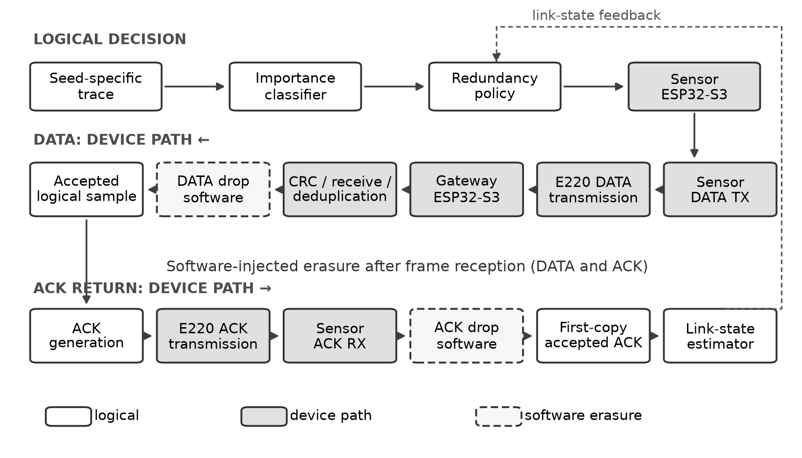
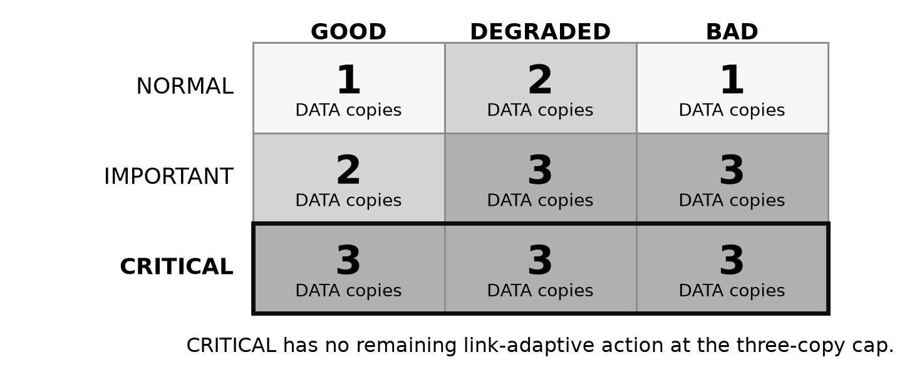
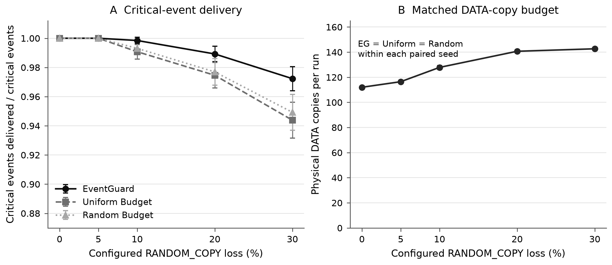
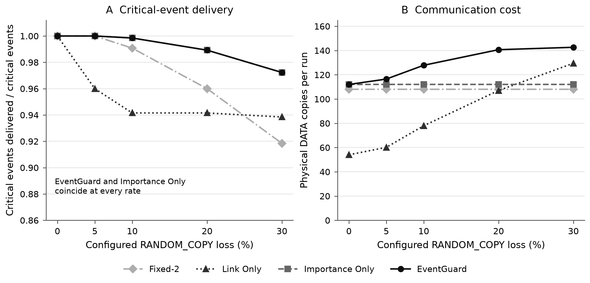
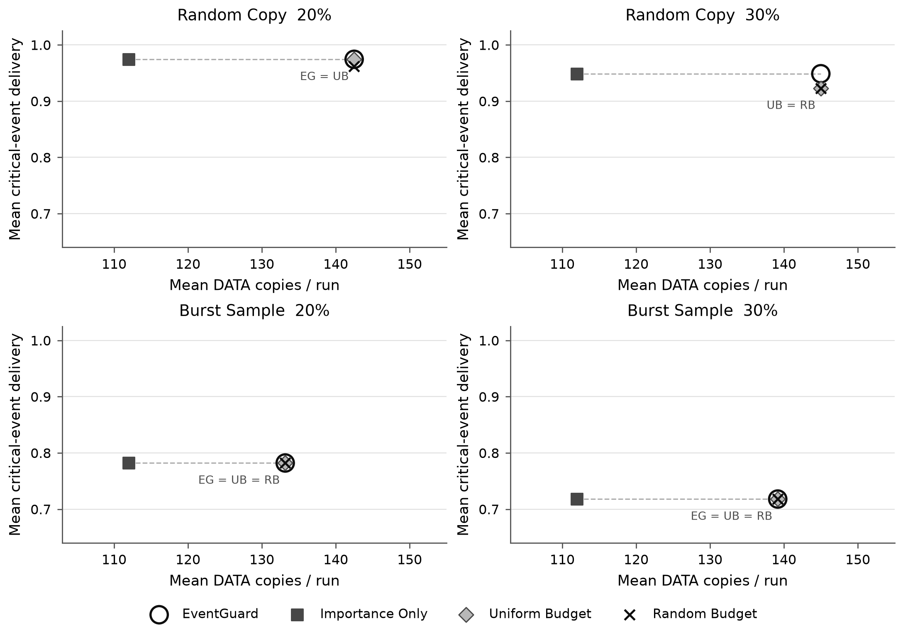
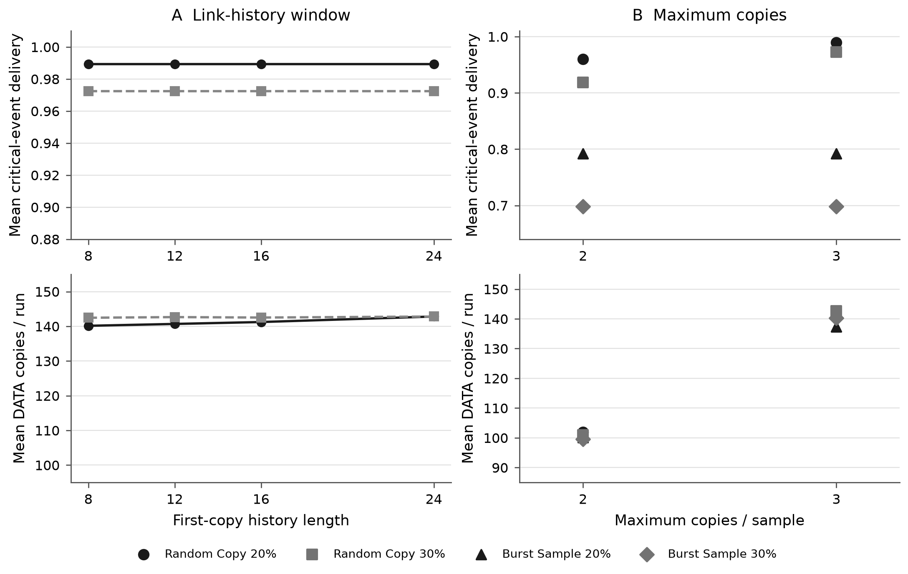

# Disentangling Event Importance and Link Adaptation for Reliable IoT Transmission: A Simulation and ESP32-S3/E220 Study

## Abstract

Periodic IoT traffic can contain rare observations whose loss matters more than the loss of routine samples, yet uniform redundancy spends communication resources without regard to event value. We study a frozen, interpretable policy that classifies each sensor sample as NORMAL, IMPORTANT, or CRITICAL and selects up to three proactive DATA copies using predicted importance and an ACK-based link state. We ask whether event-aware allocation improves critical-event delivery at an exactly matched DATA-copy budget, whether link adaptation adds value beyond importance alone, and how independent versus sample-correlated loss changes the result. The evaluation comprises 8,000 host-simulation runs, 11,000 host-only sensitivity runs, and a post-hoc balanced analysis of 96 completed runs on two ESP32-S3/E220-400T22D devices. The hardware subset uses the earliest six contiguous seeds with complete coverage after the planned 160-run experiment was interrupted; its sample size was not preregistered. An offline audit passed all 96 runs. EventGuard and IMPORTANCE_ONLY delivered exactly the same critical events in every selected hardware pair, while EventGuard used 21–33 more DATA copies per run on average. At equal copy budgets, EventGuard directed more traffic to critical samples than event-blind baselines, but its critical-delivery gains were small and confined to some independent-copy-loss conditions. Configured losses were injected in software after reception, not measured as RF packet errors. The evidence favors event importance as the useful allocation mechanism and does not support an incremental critical-delivery benefit from the evaluated link adaptation.

**Keywords:** constrained IoT communication; event importance; proactive redundancy; exact-budget evaluation; ESP32-S3; Sub-GHz radio.

## 1. Introduction

Periodic sensing is often evaluated by average packet delivery, which gives the same weight to a routine observation and a rare event that may demand intervention. In a constrained IoT link, sending additional copies of every sample consumes communication capacity; the number of copies alone says little about whether scarce transmissions reached the samples that matter. Event importance can guide this allocation. Recent ACK outcomes can also motivate adaptation to an estimated link state. These are distinct mechanisms, however, and a combined policy can obscure which one explains an observed delivery gain.

The distinction matters especially when an importance rule already assigns the maximum allowed copies to a critical sample. A subsequent link-state transition may increase traffic for other classes while having no remaining action on the class used by the primary reliability metric. Without an importance-only ablation, the resulting benefit could be attributed incorrectly to link adaptation. Without a matched budget, a combined policy's higher delivery could instead reflect higher spending. We therefore compare EventGuard with IMPORTANCE_ONLY as a non-equal-cost component ablation, and separately with event-blind allocators that receive EventGuard's **exact total DATA-copy budget** for each seed-specific trace and loss condition. Independent-copy and constructed sample-wide erasures test how the structure of loss changes the value of within-sample redundancy.

The study combines a frozen Python/C policy, an 8,000-run host matrix on evaluation seeds 31–130, 11,000 host-only sensitivity runs, and execution through a two-device ESP32-S3/E220 DATA/ACK path. The original 160-run device experiment was interrupted by an unresolved receive-path stall. We analyze the earliest six contiguous seeds with complete four-strategy/four-condition coverage: a post-hoc balanced prefix selected by execution order and completeness, not by comparative outcome. Its `n=6` sample size was not preregistered, so the device results support descriptive mechanism analysis rather than confirmatory inference.

This paper contributes:

1. A frozen, interpretable redundancy policy combining predicted event importance with first-copy ACK history, together with an explicit account of its action-space limits.
2. Paired deterministic evaluation and exact-budget event-blind controls that separate allocation quality from extra communication expenditure.
3. Importance-only and link-only ablations showing that event importance, rather than the evaluated link response, explains the observed critical-delivery benefit of frozen v1.
4. A reproducible simulation and 96-run real-device execution study that retains negative results, an unresolved later anomaly, raw records, and provenance.

Our principal finding is limited: event-aware allocation targets more communication toward critical samples and sometimes modestly improves their delivery over blind equal-budget allocation under independent copy loss. In the evaluated conditions, link adaptation added copies without improving critical-event delivery over the simpler importance-only rule.

## 2. Related Work

### 2.1. LPWAN reliability and replication

LoRaWAN specifies confirmed uplink traffic and associated downlink behavior [1], but ACKs and retransmissions incur capacity and duty-cycle costs. Capuzzo *et al.* analyze pitfalls of confirmed traffic [2], while Adelantado *et al.* describe broader LoRaWAN operating limits [3] and Magrin *et al.* examine how parameter choices, including confirmed-traffic settings, affect system performance [4]. These studies motivate cost-aware reliability evaluation; they do not provide a direct protocol baseline because our E220 devices use a custom application protocol rather than LoRaWAN. Hybrid coded replication in LoRa networks explicitly trades redundancy against reliability [5]. Our proactive copies are uncoded and deliberately simple, making the allocation rule and its cost visible. The constructed `BURST_SAMPLE` model further tests the limit of repeating copies within a single logical sample; it is not a measurement of LoRaWAN or RF burst errors.

### 2.2. Link-quality-aware adaptation

Link estimation in sensor networks has long combined observations across protocol layers, including packet and ACK outcomes [6]. Srinivasan *et al.* show that wireless losses can be bursty, so a single mean delivery rate need not characterize temporal behavior [7]. LoRaWAN adaptive-data-rate work uses link observations to adjust radio parameters and studies convergence under changing conditions [8]. Our estimator is narrower: it uses accepted first-copy ACK history to select a bounded number of application DATA copies, without changing physical-layer settings. These references support examining when history predicts future outcomes; they do not establish that this estimator captures time-varying E220 channel quality under the software-injected losses studied here.

### 2.3. Importance-aware and event-aware communication

Data-importance-aware retransmission for edge learning allocates radio resources according to training-sample utility as well as channel conditions [9]. Importance-aware user scheduling likewise incorporates learning-task value into wireless acquisition [10]. Broader semantic and task-oriented communication research asks how transmission should reflect the receiver's intended task rather than treating every bit as equally valuable [11]. Event-triggered sensor-network transmission has also been studied to reduce communication devoted to measurements that do not warrant an update [12]. These works motivate application-aware prioritization, but their objectives, importance measures, and actions differ from ours: EventGuard uses a fixed synthetic sensor-event classifier and proactive whole-frame replication, not model-uncertainty ARQ, semantic encoding, or event-triggered omission of routine samples. We claim neither field validation for the four sensor modalities nor priority over those methods.

### 2.4. Position of this study

The methodological question here is narrower than a general claim for adaptive LPWAN reliability. We separate predicted event importance from ACK-history link response, compare allocation at an exact DATA-copy budget, and test both independent copy erasures and common-mode sample erasures. The real-device study checks execution of this frozen logic and its post-reception injection path on one E220 pair. It cannot adjudicate the relative performance of the cited methods on their own protocols, workloads, or measured radio channels.

## 3. System Model and Problem Formulation

A **logical sample** $i$ is one timestamped vector $x_i$ of temperature, humidity, light, and soil-moisture values. The synthetic trace generator also assigns a ground-truth event category $g_i\in\{N,I,C\}$ from phase semantics and hazard criteria; the on-node classifier does not read $g_i$. It predicts $\hat g_i$ from sensor values and its prior state. A **physical DATA copy** is one transmitted frame for sample $i$, identified by the same logical sequence number and a copy index. The gateway validates its CRC, applies any planned receive-side DATA erasure, and deduplicates copies before counting a logical delivery. Accepted DATA elicits an ACK frame. An ACK may be physically received yet rejected by a planned application-layer ACK erasure; only an accepted first-copy ACK enters the link estimator. A scheduled set of copies is proactive redundancy, not an ACK-timeout retransmission.

Let $r_i\in\{1,2,3\}$ be the selected number of DATA copies and $Y_i=1$ when at least one copy of sample $i$ is accepted after the specified injected-loss path; otherwise $Y_i=0$. Let $\mathcal C=\{i:g_i=C\}$. The primary reliability metric is

$$
R_C=\frac{\sum_{i\in \mathcal C}Y_i}{|\mathcal C|}, \qquad B=\sum_i r_i.
$$

At a fixed DATA-copy budget $B$, the motivating allocation problem is to improve $R_C$, while tracking physical DATA copies, DATA/ACK bytes, and other communication costs. EventGuard is a deterministic heuristic for this problem, not a claimed optimizer. Equal $B$ does **not** imply equal total bytes because delivered copies generate ACK activity. Matching additionally holds the seed-specific trace and canonical DATA/ACK loss calendar fixed. The first-copy calendar is shared across strategies; effective loss over attempted copies can differ when strategies select different copy opportunities.

**Figure 1. Frozen v1 device and decision paths.** The seed-specific trace drives classification and copy selection on the Sensor ESP32-S3. DATA and ACK frames traverse the E220 device path; dashed boxes mark software erasures applied after frame reception. Only accepted first-copy ACK outcomes update the link-state estimator. Configured loss is not a measured RF packet-error rate.

## 4. EventGuard Design

### 4.1. Importance estimation

The frozen classifier uses normalized inter-sample change, deviation from a normal-state baseline, rate of change, simultaneous change across channels, and event persistence. The four normalization scales are 0.5 °C, 5 humidity points, 100 lux, and 8 soil-moisture points. A directional risk rule identifies severe soil-moisture decline or combined elevated temperature/humidity. The IMPORTANT score threshold is 0.85 and the CRITICAL directional-risk threshold is 3.0. Normal observations update the baseline with coefficient 0.06. Exact equations and evaluation hashes are preserved in [`docs/algorithm_spec_v1.md`](algorithm_spec_v1.md). The synthetic-trace classifier's CRITICAL precision (0.8125) and recall (1.0000) describe this constructed benchmark; they are not field accuracy estimates.

### 4.2. First-copy link-state estimation

The estimator records accepted-ACK outcomes for the **first** DATA copy of each logical sample, avoiding the strategy-dependent observation count that would result from including every extra copy. A 12-observation sliding window gives a first-copy success ratio. State is BAD for three consecutive first-copy failures or a ratio below 0.50; otherwise DEGRADED below 0.80; otherwise GOOD. The initial no-observation ratio is one. Physical ACK reception, injected ACK drop, and accepted ACK remain separate records.

### 4.3. Redundancy allocation

Table 1 records the frozen parameters. The base mapping assigns NORMAL/IMPORTANT/CRITICAL to one/two/three copies on a GOOD link. DEGRADED adds one base copy, clipped to the three-copy cap. BAD adds two only to IMPORTANT or CRITICAL, likewise clipped; NORMAL remains at one. The complete decision map is shown in Figure 2. All selected copies are transmitted irrespective of an earlier ACK.

**Table 1. Frozen v1 parameters relevant to the primary evaluation.** Study matrix fields are taken from the frozen evaluation manifest; `configs/default.json` also contains older pilot-matrix defaults, discussed in Section 6.9.

| Parameter | Value |
|---|---:|
| Trace | 9 phases × 6 samples = 54 samples per seed |
| Inter-sample interval | 10 s |
| IMPORTANT / CRITICAL threshold | 0.85 / 3.0 |
| Importance baseline coefficient | 0.06 |
| Link window | 12 first-copy outcomes |
| DEGRADED / BAD ratio thresholds | 0.80 / 0.50 |
| BAD consecutive first-copy failures | 3 |
| Maximum copies per sample | 3 |
| ACK wait timeout | 1,000 ms |
| DATA / ACK frame length | 26 / 13 bytes |
| E220 UART rate | 9,600 bit/s |

**Figure 2. Frozen v1 redundancy decision matrix.** Cell values are proactive DATA copies per logical sample, indexed by predicted importance and pre-sample link state. The CRITICAL row remains 3/3/3 at the frozen three-copy cap; this is policy structure, not an empirical estimate.

### 4.4. Structural implication

For a **correctly classified** CRITICAL sample, $r_i=3$ even when the link is GOOD. Because $r_i\leq3$, no DEGRADED or BAD transition can raise its redundancy. This is a constraint of frozen v1, not an empirical estimate. Link adaptation can alter NORMAL and IMPORTANT copy counts, and might matter for a misclassified critical event; on the evaluated synthetic trace, however, CRITICAL recall was 1.0000. A critical-delivery advantage over IMPORTANCE_ONLY therefore had little policy action space in this experiment.

## 5. Baselines and Budget Fairness

Table 2 separates diagnostic ablations from exact-budget comparisons. `FIXED_1`, `FIXED_2`, and `FIXED_3` send a constant one, two, or three copies. `IMPORTANCE_ONLY` applies the frozen 1/2/3 importance rule without link adaptation. `LINK_ONLY` applies 1/2/3 copies for GOOD/DEGRADED/BAD without importance. Neither fixed baselines nor component ablations are equal-cost by construction, so their delivery contrasts must be read alongside cost.

For each matched model/rate/seed/trace, the EventGuard reference determines $B$. `UNIFORM_BUDGET` first assigns one copy to each sample, then allocates remaining copies by a fixed round-robin order up to the cap. `RANDOM_BUDGET` allocates the extras by a seeded hash ordering. Their decisions may use the sample index, fixed budget, and allocation seed, but not ground truth, predicted importance, classifier score, or sensor values. The hardware budget is computed from the frozen host reference before strategy execution, allowing a seeded, interleaved execution order rather than always running EventGuard first. Actual DATA-copy totals are checked against the reference budget.

**Table 2. Evaluated strategies and comparison roles.** All eight appear in the host matrix; the four marked hardware appear in the final 96-run set.

| Strategy | Copy rule | Role | Hardware set |
|---|---|---|---|
| FIXED_1 | One per sample | Minimal fixed-copy comparison | No |
| FIXED_2 | Two per sample | Fixed-copy comparison | No |
| FIXED_3 | Three per sample | Maximum fixed-copy comparison | No |
| IMPORTANCE_ONLY | Predicted importance, 1/2/3 | Importance and link ablation | Yes |
| LINK_ONLY | GOOD/DEGRADED/BAD, 1/2/3 | Link-only ablation | No |
| EVENTGUARD | Importance plus first-copy link state, cap 3 | Combined treatment | Yes |
| UNIFORM_BUDGET | Event-blind round-robin, exact $B$ | Equal-budget control | Yes |
| RANDOM_BUDGET | Event-blind seeded order, exact $B$ | Equal-budget control | Yes |

## 6. Experimental Methodology

### 6.1. Synthetic trace and labels

Each evaluation seed generates one deterministic 54-sample realization with nine phases and a 10-second sampling interval. Small seed-dependent sensor noise makes trace hashes differ across seeds. All strategies within a paired seed receive the same realization. Values cover temperature, humidity, light, and soil moisture; benchmark runs replay these values rather than sampling the attached physical sensors. Ground-truth categories derive from the generator's phase semantics and hazard conditions. Predicted importance derives only from observed values and classifier history. Calibration seeds 1–30 were kept separate from evaluation seeds 31–130.

### 6.2. Injected-loss models

`RANDOM_COPY` makes deterministic, independently keyed DATA and ACK erasure decisions for canonical copy opportunities. `BURST_SAMPLE` marks contiguous logical samples and erases all three canonical copy opportunities of an affected sample. DATA and ACK calendars are separate and shared across strategies at a fixed model, rate, and seed. By construction, extra copies within a `BURST_SAMPLE`-erased sample cannot recover that sample. The model isolates common-mode failure; it does not represent every physical burst-fading process. Configured percentages are application-layer injection settings, not measured E220 packet-error rates. The host audit retains realized fairness alarms rather than discarding unusual calendars.

### 6.3. Host simulation

The frozen pre-hardware matrix contains eight strategies, five configured rates (0%, 5%, 10%, 20%, 30%), two principal loss models, and 100 evaluation seeds (31–130): **8,000 runs**. Each uses its seed-specific trace and matched canonical calendars. Python/C parity checks cover importance decisions, copy selection, link transitions, fault decisions, and budget allocation. An earlier 300-run E220 pilot used a different 18-sample trace and is not pooled with frozen v1.

### 6.4. Sensitivity and ablation

An additional **11,000 host-only** runs vary one axis at a time: CRITICAL threshold {2.0, 2.5, 3.0, 3.5, 4.0}, link-window length {8, 12, 16, 24}, or maximum copies {2, 3}. These diagnostic perturbations do not retune the default experiment. Four copies are unsupported because v1 defines only three canonical copy opportunities; a fourth against the same calendar would receive an invalid, unerased slot. Component ablations compare `FIXED_2`, `IMPORTANCE_ONLY`, `LINK_ONLY`, and `EVENTGUARD`; exact-budget controls address allocation fairness.

### 6.5. Hardware execution

Two ESP32-S3 boards carried Sensor and Gateway firmware through E220-400T22D modules under ESP-IDF v5.4.4. DATA and ACK were real transmitted frames on this single device pair, using 9,600-bit/s UART. The Sensor replayed the deterministic trace; attached environmental sensors did not generate benchmark data. The Gateway received, CRC-checked, and deduplicated DATA. Planned software erasures acted after receiver-side frame arrival. Raw Sensor/Gateway serial logs, END counters, UART diagnostics, and per-run manifests were retained. A v2 12-run smoke validation preceded Stage 1. Receive-parser and host-validation repairs were engineering changes; the frozen classifier, link estimator, redundancy policy, trace, and loss calendar were not changed for these results.

**Table 3. Hardware execution scope.** This is a single validated path, not a general deployment.

| Item | Observed setup |
|---|---|
| Nodes and topology | One Sensor ESP32-S3 and one Gateway ESP32-S3; one link |
| Radio modules | One E220-400T22D per node |
| Firmware environment | ESP-IDF v5.4.4; frozen EventGuard-v1 research logic |
| Serial/radio path | E220 UART at 9,600 bit/s; real DATA and ACK frames |
| Benchmark input | Seed-specific deterministic trace replay, 54 samples/run |
| Programmed impairments | DATA/ACK software erasures after reception |
| Preserved evidence | Raw logs, run manifests, firmware hashes, counters, diagnostics |

### 6.6. Construction of the balanced hardware analysis

The original Stage 1 plan contained four strategies × two models × two rates (20%, 30%) × ten seeds (31–40), or **160 runs**, with interleaved seeded strategy order. During later expansion, run103 (`UNIFORM_BUDGET / RANDOM_COPY / 30% / seed37`) stalled while waiting for an ACK; one DATA frame was absent from Gateway pre-injection logs. Its low-level cause remains unresolved. The final set is a **post-hoc balanced analysis of the interrupted Stage 1 experiment**: the earliest contiguous seed prefix, 31–36, for which all four strategies and all four conditions were complete and auditable. This yields 96 completed runs and six paired seed units per condition. Selection used execution order, completeness, and auditability, not delivery outcomes. The sample size `n=6` was **not preregistered**. Partial seed-37 records and run103 remain preserved outside the paired analysis.

### 6.7. Integrity and reference checks

The offline finalizer re-parses preserved raw logs and checks raw/manifest hashes, firmware identities, run configuration, trace/calendar hashes, all 54 event/sample records, per-copy DATA/ACK decisions, importance and selected-copy sequences, link transitions, Sensor/Gateway END counters, UART diagnostics, and exact budget totals. All **96/96** selected runs passed. There were zero uncontrolled physical DATA misses, zero uncontrolled physical ACK misses, zero policy divergences, and zero sample-level delivery differences from matched host references. This establishes agreement for deterministic replay and software injection, not a measured RF error model. Independent USB reader byte-count telemetry absent from the historical raw schema cannot be reconstructed; firmware UART diagnostics and event lines were cross-checked instead.

### 6.8. Metrics and statistics

Critical-event delivery is R_C; overall delivery is the delivered fraction of all logical samples. Physical DATA copies count every proactive frame transmission; bytes include DATA and ACK transmissions. Critical traffic share is the fraction of DATA copies assigned to ground-truth CRITICAL samples, computed only after the run. Truth is never an allocator input. The communication-time field is the UART serialization proxy `(DATA bytes + ACK bytes) × 10 / 9600` seconds, not measured RF airtime. There is no measured energy or Joule estimate.

The statistical unit is one paired seed/run under a fixed condition, not a packet, copy, or logical sample. Hardware summaries report mean, median, sample standard deviation, and a two-sided 95% Student-t interval across six seed units. Paired tables also report wins/ties/losses, mean and median paired differences, and a two-sided exact conditional sign-randomization p-value for Wilcoxon signed ranks. Differences of magnitude at most `1e-12` are treated as zero and omitted from ranking; equal absolute nonzero differences receive midranks. The exact null distribution enumerates sign assignments conditional on these midranks. When every pair ties, the implementation reports `p=1` and rank-biserial effect size zero; otherwise rank-biserial is the positive-minus-negative signed-rank sum divided by the total rank sum. Holm-adjusted values cover the family of 12 critical-delivery contrasts (three baselines across four conditions); other metric p-values remain unadjusted. The unbounded t intervals may extend beyond [0,1] for a delivery ratio and are not clipped. Given post-hoc subset construction and only six paired seeds, **all p-values and intervals are descriptive/exploratory; no confirmatory significance claim is made**.

### 6.9. Versioned configuration and reproducibility

The frozen specification, study manifests, source hashes, archived firmware images, raw logs, and finalizer provenance identify the evaluated version. Root `configs/default.json` retains older pilot-oriented matrix defaults; the frozen-v1 study manifests and recorded calls define the 54-sample trace, evaluated strategies, and loss models used here. Reproduction should follow those versioned records rather than infer the completed experiment from the root defaults.

## 7. Results

### 7.1. Host-simulation overview

In the 100-seed host matrix, EventGuard and IMPORTANCE_ONLY had identical CRITICAL delivery in every matched run. Under `RANDOM_COPY` at 20% configured loss, their mean CRITICAL delivery was 0.9892, versus 0.9746 for equal-budget UNIFORM_BUDGET and 0.9769 for equal-budget RANDOM_BUDGET. At 30%, the corresponding means were 0.9723, 0.9438, and 0.9492. Directing the same total copy budget by predicted importance can help under independent copy erasures; this does not establish a gain from the link estimator. At 0% loss, delivery saturated at 1.0000 for all strategies. Under `BURST_SAMPLE`, all strategies tied in CRITICAL delivery within each rate.

**Figure 3. Exact-budget host comparison under software-injected `RANDOM_COPY` loss.** Panel A shows mean critical-event delivery ratios (vertical axis displayed from 0.87 to 1.01); Panel B shows mean physical DATA copies per 54-sample run. Error bars are two-sided 95% Student-t intervals across 100 paired evaluation seeds (31–130). EventGuard, Uniform Budget, and Random Budget have exactly matched DATA-copy counts within each seed and configured loss rate (0%, 5%, 10%, 20%, 30%); the single Panel B series represents all three.

### 7.2. Ablation

The host ablation separates importance from link response. At `RANDOM_COPY` 20%, `FIXED_2` delivered 0.9600 of CRITICAL events, versus 0.9892 for both IMPORTANCE_ONLY and EventGuard; their mean DATA-copy counts were 108.00, 112.00, and 140.68. At 30%, the three CRITICAL delivery means were 0.9185, 0.9723, and 0.9723; EventGuard used 142.65 copies versus 112.00 for IMPORTANCE_ONLY. `LINK_ONLY` delivered 0.942 at 20% and 0.938 at 30% in the same host model. These component comparisons are **not equal-budget tests**. Importance, rather than added link response, accounts for the combined policy's observed critical-delivery level.

**Figure 4. Host ablation under software-injected `RANDOM_COPY` loss.** Panel A plots mean critical-event delivery ratios (vertical axis displayed from 0.86 to 1.01); Panel B plots mean physical DATA copies per 54-sample run for Fixed-2, Link Only, Importance Only, and EventGuard. Each point summarizes 100 evaluation seeds at one configured loss rate. Importance Only and EventGuard coincide in Panel A, while their DATA-copy costs differ in Panel B. These component ablations are not equal-budget comparisons.

### 7.3. Sensitivity

Across link-window lengths 8/12/16/24, mean CRITICAL delivery did not change within the reported host conditions, although mean copies and state transitions varied. The CRITICAL-threshold sweep from 2.0 to 4.0 likewise changed copy allocation slightly without changing reported condition-level CRITICAL delivery. Increasing the copy cap from two to three improved host CRITICAL delivery under `RANDOM_COPY` (0.9600 to 0.9892 at 20%; 0.9185 to 0.9723 at 30%) at greater cost. Under `BURST_SAMPLE` at 20% or 30%, the cap change left CRITICAL delivery unchanged. No cap-four result exists in frozen v1.

The associated sensitivity visualization is presented as Figure 6 after the hardware cost figure.

### 7.4. Real-device execution results

Table 4 reports means over the six paired hardware seeds. Ratios are fractions of ground-truth CRITICAL samples delivered, while copies and bytes are per-run means. Median, standard deviation, confidence interval, and paired statistics remain in the preserved final analysis files. All configured losses were injected in software after reception.

**Table 4. Final 96-run balanced hardware summary (six paired seeds per condition).** RC denotes `RANDOM_COPY`; BS denotes `BURST_SAMPLE`. Critical traffic share uses truth only in retrospective analysis.

| Condition | Strategy | Mean CRITICAL delivery | Mean DATA copies | Mean total bytes | Critical traffic share |
|---|---|---:|---:|---:|---:|
| RC 20% | EVENTGUARD | 0.9744 | 142.50 | 5,154.5 | 27.4% |
| RC 20% | IMPORTANCE_ONLY | 0.9744 | 112.00 | 4,056.0 | 34.8% |
| RC 20% | UNIFORM_BUDGET | 0.9744 | 142.50 | 5,165.3 | 23.0% |
| RC 20% | RANDOM_BUDGET | 0.9615 | 142.50 | 5,167.5 | 24.1% |
| RC 30% | EVENTGUARD | 0.9487 | 145.00 | 5,033.2 | 26.9% |
| RC 30% | IMPORTANCE_ONLY | 0.9487 | 112.00 | 3,913.0 | 34.8% |
| RC 30% | UNIFORM_BUDGET | 0.9231 | 145.00 | 5,057.0 | 24.0% |
| RC 30% | RANDOM_BUDGET | 0.9231 | 145.00 | 5,063.5 | 24.0% |
| BS 20% | EVENTGUARD | 0.7821 | 133.17 | 4,857.7 | 29.3% |
| BS 20% | IMPORTANCE_ONLY | 0.7821 | 112.00 | 4,084.2 | 34.8% |
| BS 20% | UNIFORM_BUDGET | 0.7821 | 133.17 | 4,862.0 | 21.1% |
| BS 20% | RANDOM_BUDGET | 0.7821 | 133.17 | 4,851.2 | 23.9% |
| BS 30% | EVENTGUARD | 0.7179 | 139.17 | 4,894.5 | 28.1% |
| BS 30% | IMPORTANCE_ONLY | 0.7179 | 112.00 | 3,943.3 | 34.8% |
| BS 30% | UNIFORM_BUDGET | 0.7179 | 139.17 | 4,920.5 | 22.7% |
| BS 30% | RANDOM_BUDGET | 0.7179 | 139.17 | 4,894.5 | 23.9% |

All 96 selected runs passed offline checks and showed zero sample-level delivery differences from deterministic host references. This supports faithful execution of the frozen trace, policy, and injected calendar on the device path, not prediction of an uncontrolled radio channel.

### 7.5. Exact-budget paired comparisons

UNIFORM_BUDGET and RANDOM_BUDGET used exactly EventGuard's DATA-copy count in every selected condition and seed. EventGuard allocated a larger share of copies to ground-truth CRITICAL samples than either blind allocator in all four conditions (Table 4). Under `RANDOM_COPY` 30%, EventGuard exceeded each blind baseline in **two of six** paired seeds and tied four; its mean paired critical-delivery difference was +0.0256 against each. The unadjusted exact Wilcoxon p-value was 0.50 for each, and the exploratory Holm-adjusted value across 12 critical-delivery comparisons was 1.00. Under `RANDOM_COPY` 20%, it tied UNIFORM_BUDGET in all six pairs and exceeded RANDOM_BUDGET in one, with a +0.0128 mean difference. Both `BURST_SAMPLE` rates yielded six ties against each blind baseline. These sparse differences support targeted allocation and limited condition-specific delivery gains, not confirmatory general superiority. Equal DATA-copy budgets need not produce identical total bytes because ACK activity varies.

### 7.6. Pareto tradeoff

IMPORTANCE_ONLY and EventGuard had **identical CRITICAL delivery in all 24 matched hardware seed/condition pairs**. EventGuard nevertheless used 30.50, 33.00, 21.17, and 27.17 additional DATA copies per run on average in RC 20%, RC 30%, BS 20%, and BS 30%. Extra total bytes were 1,098.5, 1,120.2, 773.5, and 951.2. On the empirical within-condition frontier of mean CRITICAL delivery versus DATA copies or bytes, IMPORTANCE_ONLY appeared in **4/4** conditions and EventGuard in **0/4**. These are descriptive frontiers over observed means, not uncertainty regions.

**Figure 5. Real-device critical-event delivery versus DATA-copy cost.** Each panel is one configured software-injected loss model/rate; each strategy point is the mean critical-event delivery ratio versus mean physical DATA copies per 54-sample run across six paired seeds (31–36). The delivery axis is displayed from 0.64 to 1.025. The 96-run set is a post-hoc balanced prefix from one ESP32-S3/E220 device pair. The dashed horizontal segment connects Importance Only and EventGuard at identical observed delivery but different copy cost. Coincident event-blind points share their exact plotted coordinates. This empirical Pareto display is descriptive, not a significance test or measured RF-loss result.

**Figure 6. Frozen host-only sensitivity under software-injected loss.** Left: mean critical-event delivery and physical DATA copies per 54-sample run for first-copy link-history windows 8, 12, 16, and 24 under `RANDOM_COPY` at 20% and 30%. Right: the same metrics for maximum redundancy 2 versus 3 under `RANDOM_COPY` and `BURST_SAMPLE` at 20% and 30%. Each plotted mean uses 100 evaluation seeds; no interpolation or cap-four result is shown.

## 8. Why Did Link Adaptation Not Help?

The matched host and device-path comparisons provide an observed result: EventGuard and IMPORTANCE_ONLY delivered exactly the same critical events in the evaluated pairs, while EventGuard spent more DATA copies and bytes. The policy matrix explains why this negative ablation is plausible, but the matrix and the loss models should be separated from claims about an uncontrolled RF channel.

**Structural saturation.** A correctly classified CRITICAL sample receives three copies in GOOD, DEGRADED, and BAD states. Since the frozen cap is also three, link adaptation has **no remaining action space** for that sample. This is a structural relationship between policy design and the critical-delivery objective, not an inference that another threshold would necessarily perform better. Link response could still affect a ground-truth critical event classified as NORMAL or IMPORTANT, but the synthetic-trace classifier's CRITICAL recall was 1.0000. That measured benchmark property limits this route in the current evaluation; it does not establish field recall.

**KPI–action-space mismatch.** The primary KPI is ground-truth critical-event delivery, whereas the remaining link-dependent copy changes apply principally to predicted NORMAL and IMPORTANT samples. Those changes could matter for other objectives, including important-event delivery, but they need not affect the reported critical-delivery ratio. The extra EventGuard copies therefore do not provide evidence of better protection for the objective class. Future link-aware policies would need explicit control authority for critical events, with costs and fault opportunities specified anew.

**Independent copy loss.** Under `RANDOM_COPY`, erasures are independently keyed by copy opportunity. Past accepted first-copy ACK outcomes need not predict the next copy's programmed erasure. Weak predictive value is a mechanism hypothesis consistent with the observed zero incremental critical-delivery gain; it is **not** a measurement of E220 temporal correlation, fading, or interference. No RF-channel conclusion follows from this model alone.

**Common-mode sample loss.** `BURST_SAMPLE` erases all copy opportunities for a selected logical sample by construction. Repeating that sample cannot reverse its programmed erasure, regardless of estimated link state. This explains the observed ties under this specific model and does not imply that redundancy is ineffective under every bursty physical channel: real bursts may have different duration, timing, or diversity opportunities.

## 9. Discussion

The evaluation separates three claims that a single combined-policy comparison would conflate. First, importance-aware allocation changes *where* copies are spent: EventGuard assigns a larger fraction of an identical DATA-copy budget to critical samples than event-blind controls. Second, this allocation produced only small, condition-dependent critical-delivery gains under independent copy loss; it produced none under programmed sample-wide erasure. Third, link adaptation changed *how many* copies the combined policy spent relative to IMPORTANCE_ONLY without changing the critical events delivered in the selected pairs. Complexity did not automatically improve the target reliability metric, and the simpler ablation occupied the observed critical-delivery/cost frontier in all four conditions.

The negative link result is informative about objective alignment. A controller cannot improve delivery for a correctly classified class by raising its copy count if that class already sits at the cap in every link state. Adding state estimation while leaving no effective action for the target class can increase cost without moving the primary KPI. Exact-budget controls prevent a separate confusion: additional transmissions are expenditure, whereas an advantage at the same expenditure is evidence about allocation. A future adaptive design should reserve actual control authority for its target class and test that authority under measured, time-varying RF conditions.

The 96 selected device runs agree with matched host references at the sample-outcome and policy-decision levels, supporting faithful execution of the frozen logic and deterministic injection on one E220 path. They do not establish fading, interference tolerance, range, LoRaWAN behavior, or energy efficiency. The preserved incomplete run103 exposes an unresolved receive-path stall beyond the balanced prefix. These are distinct questions of simulator fidelity, device-path correctness, and channel performance; only the first two are addressed by the present study.

## 10. Limitations

**Table 5. Scope boundaries and consequences.** None changes the recorded negative ablation.

| Boundary | Consequence for interpretation |
|---|---|
| Synthetic, seed-specific 54-sample traces | Limited event diversity; no field-labeled classifier validation |
| One Sensor–Gateway device pair and one topology | No multi-node contention or multi-gateway diversity evidence |
| Deterministic post-reception DATA/ACK injection | Configured 20%/30% loss is not measured physical RF PER |
| No controlled fading, interference, or range sweep | No claim about uncontrolled time-varying RF performance |
| UART serialization proxy only | No measured RF PHY airtime, regulatory duty-cycle, or Joule energy result |
| Post-hoc complete prefix, six seeds per condition | Descriptive/exploratory inference; broad population claims unsupported |
| Unresolved seed-37 run103 stall | Hardware reliability outside the selected clean runs remains uncertain |
| Custom E220 application protocol | Results do not characterize LoRaWAN confirmed-message operation |

Seed-level replication cannot substitute for independent device pairs, antennas, placements, interference regimes, or measured channel histories. The classifier uses designed synthetic labels; its confusion matrix is not a field accuracy estimate. No multi-node traffic contention, multi-gateway reception, current draw, regulatory duty-cycle, or measured physical packet-error rate was evaluated. The earlier v0 pilot remains separate because its shorter trace and design cannot be pooled with frozen v1.

## 11. Future Work

A next experiment should vary an actual radio channel over time while recording physical reception, available RSSI/SNR or another link observable, state transitions, and unplanned errors separately from deliberate injection. A separately versioned EventGuard-v2 design could provide genuine action space for CRITICAL events—for example, a changed copy cap paired with an expanded canonical calendar—before testing whether link prediction adds value. This requires renewed Python/C parity and device-path validation rather than reinterpretation of v1. Multi-node contention and multi-gateway spatial redundancy would test mechanisms absent from the single-link study. Field-labeled events would assess classifier validity; measured current and RF airtime would allow energy and regulatory-cost analysis. These are new studies, not a proposal to fill the interrupted Stage 1 matrix for appearance's sake.

## 12. Conclusion

Frozen EventGuard-v1 combines predicted event importance with first-copy ACK history to allocate proactive DATA copies. Importance-aware allocation directed more of an identical copy budget to critical samples than event-blind controls, with only limited and condition-specific critical-delivery gains under independent-copy erasures and none under the constructed sample-wide erasure model. Link adaptation did not improve critical-event delivery over IMPORTANCE_ONLY in any selected device pair and raised communication cost; IMPORTANCE_ONLY was more cost-efficient for the evaluated objective.

The central design lesson is to align an adaptive component's remaining actions with the outcome it is meant to improve. Measured, time-varying RF studies and a separately specified policy with control authority over critical-sample protection are needed before broader claims about link adaptation.

## Data and Code Availability

The public [EventGuard-LoRa repository](https://github.com/Sver0411/EventGuard-LoRa) and frozen `v1.0.0` release provide the algorithm specification, source code, archived experimental manifests and raw logs, analysis scripts, and identifiers for the selected 96-run hardware dataset. The repository's README and final hardware analysis files give offline reproduction commands; `tools/finalize_hardware_dataset.py` regenerates the final audit and descriptive statistics from preserved records without accessing devices. Public access supports inspection and citation. Reuse permissions are described in the repository's `NOTICE.md`.

## References

[1] LoRa Alliance, [*TS001-1.0.4 LoRaWAN L2 1.0.4 Specification*](https://resources.lora-alliance.org/document/ts001-1-0-4-lorawan-l2-1-0-4-specification), 2023.

[2] M. Capuzzo, D. Magrin, and A. Zanella, [“Confirmed Traffic in LoRaWAN: Pitfalls and Countermeasures,”](https://doi.org/10.23919/MedHocNet.2018.8407095) *Proceedings of the 17th Annual Mediterranean Ad Hoc Networking Workshop (Med-Hoc-Net)*, 2018.

[3] F. Adelantado, X. Vilajosana, P. Tuset-Peiro, B. Martinez, J. Melia-Segui, and T. Watteyne, [“Understanding the Limits of LoRaWAN,”](https://doi.org/10.1109/MCOM.2017.1600613) *IEEE Communications Magazine*, vol. 55, no. 9, pp. 34–40, 2017.

[4] D. Magrin, M. Capuzzo, and A. Zanella, [“A Thorough Study of LoRaWAN Performance Under Different Parameter Settings,”](https://doi.org/10.1109/JIOT.2019.2946487) *IEEE Internet of Things Journal*, vol. 7, no. 1, pp. 116–127, 2020.

[5] J. M. de Souza Sant’Ana, A. Hoeller, R. D. Souza, S. Montejo-Sánchez, H. Alves, and M. de Noronha-Neto, [“Hybrid Coded Replication in LoRa Networks,”](https://doi.org/10.1109/TII.2020.2966120) *IEEE Transactions on Industrial Informatics*, vol. 16, no. 8, pp. 5577–5585, 2020.

[6] R. Fonseca, O. Gnawali, K. Jamieson, and P. Levis, [“Four-Bit Wireless Link Estimation,”](https://conferences.sigcomm.org/hotnets/2007/papers/hotnets6-final131.pdf) *Proceedings of the Sixth Workshop on Hot Topics in Networks (HotNets VI)*, 2007.

[7] K. Srinivasan, M. A. Kazandjieva, S. Agarwal, and P. Levis, [“The β-Factor: Measuring Wireless Link Burstiness,”](https://doi.org/10.1145/1460412.1460416) *Proceedings of the 6th ACM Conference on Embedded Networked Sensor Systems (SenSys)*, pp. 29–42, 2008.

[8] J. Finnegan, R. Farrell, and S. Brown, [“Analysis and Enhancement of the LoRaWAN Adaptive Data Rate Scheme,”](https://doi.org/10.1109/JIOT.2020.2982745) *IEEE Internet of Things Journal*, vol. 7, no. 8, pp. 7171–7180, 2020.

[9] D. Liu, G. Zhu, Q. Zeng, J. Zhang, and K. Huang, [“Wireless Data Acquisition for Edge Learning: Data-Importance Aware Retransmission,”](https://doi.org/10.1109/TWC.2020.3024980) *IEEE Transactions on Wireless Communications*, vol. 20, no. 1, pp. 406–420, 2021.

[10] D. Liu, G. Zhu, J. Zhang, and K. Huang, [“Data-Importance Aware User Scheduling for Communication-Efficient Edge Machine Learning,”](https://doi.org/10.1109/TCCN.2020.2999606) *IEEE Transactions on Cognitive Communications and Networking*, vol. 7, no. 1, pp. 265–278, 2021.

[11] Q. Lan, D. Wen, Z. Zhang, Q. Zeng, X. Chen, P. Popovski, and K. Huang, [“What Is Semantic Communication? A View on Conveying Meaning in the Era of Machine Intelligence,”](https://doi.org/10.23919/JCIN.2021.9663101) *Journal of Communications and Information Networks*, vol. 6, no. 4, pp. 336–371, 2021.

[12] X. Ge, Q.-L. Han, and Z. Wang, [“A Dynamic Event-Triggered Transmission Scheme for Distributed Set-Membership Estimation Over Wireless Sensor Networks,”](https://doi.org/10.1109/TCYB.2017.2769722) *IEEE Transactions on Cybernetics*, vol. 49, no. 1, pp. 171–183, 2019.
