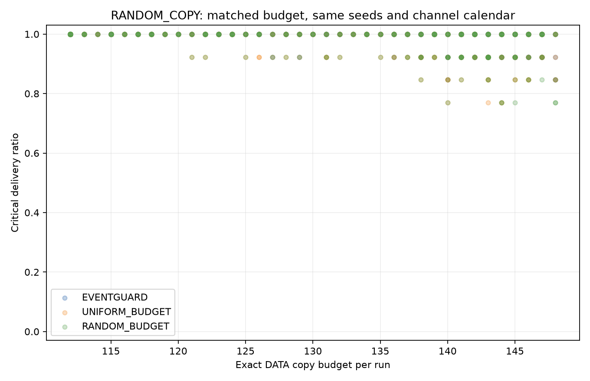
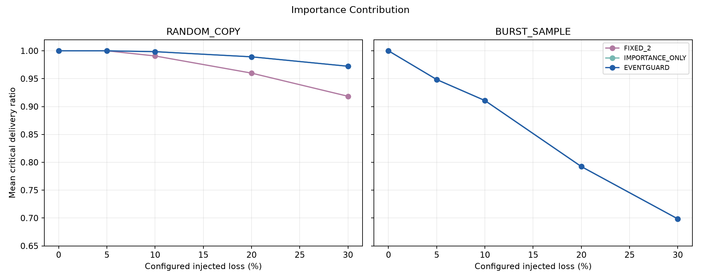
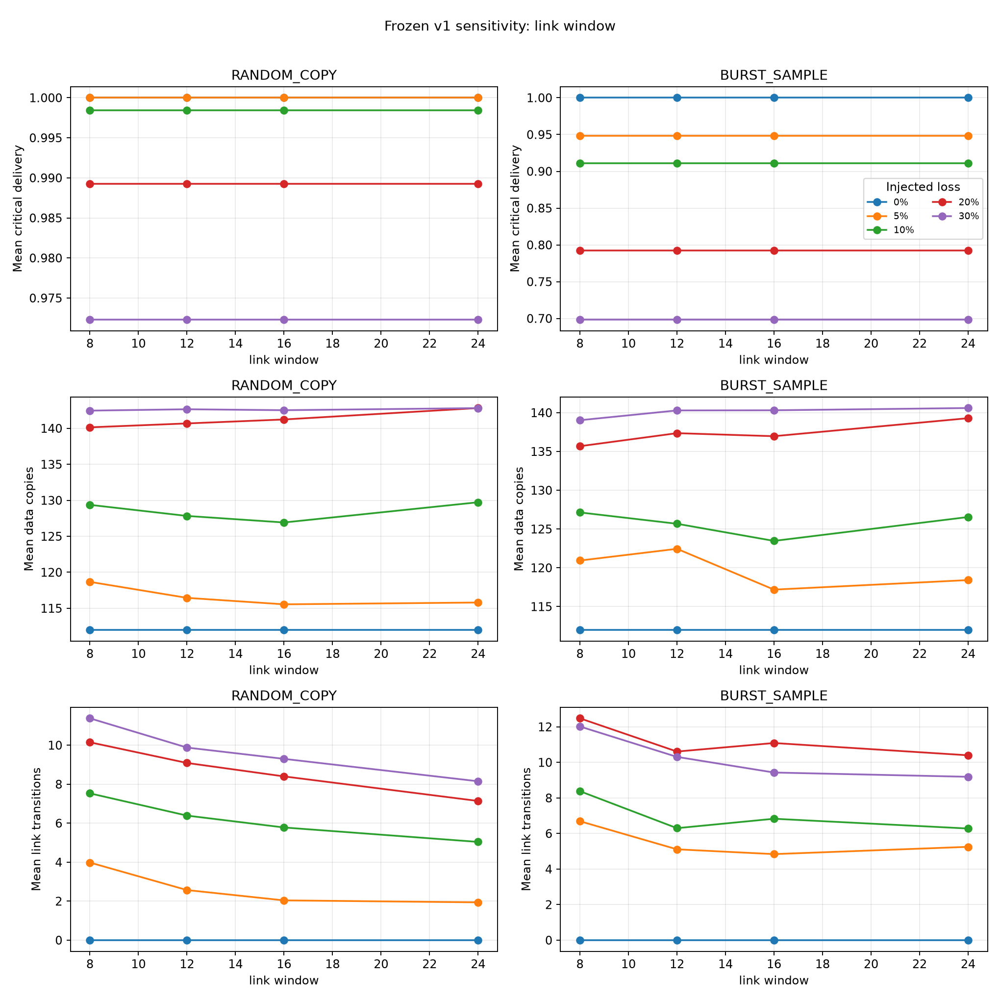

# When Does Link-Aware Redundancy Help? An Empirical Study of Event-Importance-Aware Reliability for Critical IoT Events

**Manuscript status:** submission-oriented draft; venue, author affiliation, and contact details to be supplied. The repository identifies the author as `Sver0411` in `CITATION.cff`. This manuscript reports the frozen EventGuard-v1 study and does not describe a LoRaWAN implementation.

## Abstract

Periodic IoT traffic can contain rare observations whose loss matters more than the loss of routine samples, yet uniform redundancy spends communication resources without regard to event value. We study a frozen, interpretable policy that classifies each sensor sample as NORMAL, IMPORTANT, or CRITICAL and selects up to three proactive DATA copies using predicted importance and an ACK-based link state. We ask whether event-aware allocation improves critical-event delivery at an exactly matched DATA-copy budget, whether link adaptation adds value beyond importance alone, and how independent versus sample-correlated loss changes the result. The evaluation comprises 8,000 host-simulation runs, 11,000 host-only sensitivity runs, and a post-hoc balanced analysis of 96 completed runs on two ESP32-S3/E220-400T22D devices. The hardware subset uses the earliest six contiguous seeds with complete coverage after the planned 160-run experiment was interrupted; its sample size was not preregistered. An offline audit passed all 96 runs. EventGuard and IMPORTANCE_ONLY delivered exactly the same critical events in every selected hardware pair, while EventGuard used 21–33 more DATA copies per run on average. At equal copy budgets, EventGuard directed more traffic to critical samples than event-blind baselines, but its critical-delivery gains were small and confined to some independent-copy-loss conditions. Configured losses were injected in software after reception, not measured as RF packet errors. The evidence favors event importance as the useful allocation mechanism and does not support an incremental critical-delivery benefit from the evaluated link adaptation.

**Keywords:** constrained IoT communication; event importance; proactive redundancy; exact-budget evaluation; ESP32-S3; Sub-GHz radio.

## 1. Introduction

Periodic sensing is often evaluated by average packet delivery. That measure can obscure the loss of a comparatively rare observation that indicates a critical change in the monitored process. Sending the same number of copies for every sample is simple, but can spend scarce transmission opportunities on routine observations while critical samples remain exposed. A classifier can instead assign a bounded redundancy level according to predicted event importance. A second, appealing step is to raise redundancy when recent ACK outcomes suggest a poor link. Whether that additional link response improves the intended *critical-event* outcome is an empirical question: the policy may already allocate its maximum number of copies to a correctly identified critical sample.

Raw reliability comparisons are insufficient when strategies send different amounts of traffic. A policy that sends more copies may deliver more events simply because it spends more. We therefore compare EventGuard with event-blind allocators that receive its **exact total DATA-copy budget** for each matched seed, trace, loss model, and loss rate. Separately, an importance-only ablation isolates the incremental value and cost of the link-state component. The loss models distinguish independent copy erasures from a constructed common-mode erasure of all copy opportunities for a logical sample.

The study uses a frozen Python/C policy, an 8,000-run host matrix on evaluation seeds 31–130, 11,000 host-only sensitivity runs, and executions through a two-device ESP32-S3/E220 DATA/ACK path. The hardware analysis is deliberately narrower than the original plan: the 160-run Stage 1 expansion stopped after an unresolved receive-path stall, and the paper analyzes the first six contiguous seeds with full four-strategy/four-condition coverage. This subset was selected by execution order and completeness, not comparative outcomes, but `n=6` was chosen after the interruption. The results are descriptive rather than confirmatory.

This paper contributes:

1. An explicitly frozen, interpretable event-importance and first-copy-link-state policy whose action space and structural limits can be inspected.
2. Exact-copy-budget event-blind baselines, paired deterministic trace/loss calendars, and separate accounting for injected erasures and uncontrolled physical anomalies.
3. A host evaluation spanning 8,000 primary runs and 11,000 sensitivity runs, including importance, link, copy-cap, and loss-structure ablations.
4. An auditable 96-run real-device execution analysis that preserves an unfavorable link-adaptation result, the interrupted run, raw records, and provenance.

Our principal finding is limited: event-aware allocation targets more communication toward critical samples and sometimes modestly improves their delivery over blind equal-budget allocation under independent copy loss. In the evaluated conditions, link adaptation added copies without improving critical-event delivery over the simpler importance-only rule.

## 2. Related Work

ACK-based reliability is familiar in LPWAN research, but protocol details matter. The LoRa Alliance LoRaWAN L2 specification defines a network protocol and confirmed-message behavior [1]. Work on confirmed LoRaWAN traffic documents the cost of downlink ACK activity in larger networks [2]. EventGuard instead uses a compact application protocol over E220 modules; it is **not LoRaWAN**, and the present single-link experiment makes no claim about LoRaWAN scalability or duty-cycle compliance.

Replication is another way to trade airtime and traffic for delivery. Hybrid coded replication has been studied for LoRa networks [3], providing a relevant contrast to EventGuard's simple, uncoded proactive copies. Importance-aware ARQ has also been proposed for wireless data acquisition in edge learning [4]. That work defines importance in terms of a learning task and considers retransmission decisions, whereas our importance label describes synthetic sensor-event priority and our selected copies are transmitted proactively even if an ACK arrives. A broader comparison to channel-aware scheduling under measured, time-varying link quality remains [REF NEEDED]. Literature specific to field-validated prioritization of the four sensor modalities used here also remains [REF NEEDED]. These gaps preclude a priority or generality claim over existing methods.

## 3. System Model and Problem Formulation

A **logical sample** $i$ is one timestamped vector $x_i$ of temperature, humidity, light, and soil-moisture values. The synthetic trace generator also assigns a ground-truth event category $g_i\in\{N,I,C\}$ from phase semantics and hazard criteria; the on-node classifier does not read $g_i$. It predicts $\hat g_i$ from sensor values and its prior state. A **physical DATA copy** is one transmitted frame for sample $i$, identified by the same logical sequence number and a copy index. The gateway validates its CRC, applies any planned receive-side DATA erasure, and deduplicates copies before counting a logical delivery. Accepted DATA elicits an ACK frame. An ACK may be physically received yet rejected by a planned application-layer ACK erasure; only an accepted first-copy ACK enters the link estimator. A scheduled set of copies is proactive redundancy, not an ACK-timeout retransmission.

Let $r_i\in\{1,2,3\}$ be the selected number of DATA copies and $Y_i=1$ when at least one copy of sample $i$ is accepted after the specified injected-loss path; otherwise $Y_i=0$. Let $\mathcal C=\{i:g_i=C\}$. The primary reliability metric is

$$
R_C=\frac{\sum_{i\in \mathcal C}Y_i}{|\mathcal C|}, \qquad B=\sum_i r_i.
$$

At a fixed DATA-copy budget $B$, the motivating allocation problem is to improve $R_C$, while tracking physical DATA copies, DATA/ACK bytes, and other communication costs. EventGuard is a deterministic heuristic for this problem, not a claimed optimizer. Equal $B$ does **not** imply equal total bytes because delivered copies generate ACK activity. Matching additionally holds the seed-specific trace and canonical DATA/ACK loss calendar fixed. The first-copy calendar is shared across strategies; effective loss over attempted copies can differ when strategies select different copy opportunities.

**Figure 1. System overview (schematic to redraw for submission).** The diagram describes the measured execution path and the distinct post-reception software-erasure layer; it is not a topology or RF channel measurement.

```text
seed-specific 54-sample trace --> classifier --> copy policy --> Sensor ESP32-S3
                                                        | DATA copies
                                                       E220 radio
                                                        |
                                             Gateway ESP32-S3 --> deduplication
                                                        |
                                                   ACK frames
                                                        |
                                  Sensor first-copy accepted-ACK history

         deterministic DATA/ACK application-layer erasures act after reception
```

## 4. EventGuard Design

### 4.1. Importance estimation

The frozen classifier uses normalized inter-sample change, deviation from a normal-state baseline, rate of change, simultaneous change across channels, and event persistence. The four normalization scales are 0.5 °C, 5 humidity points, 100 lux, and 8 soil-moisture points. A directional risk rule identifies severe soil-moisture decline or combined elevated temperature/humidity. The IMPORTANT score threshold is 0.85 and the CRITICAL directional-risk threshold is 3.0. Normal observations update the baseline with coefficient 0.06. Exact equations and evaluation hashes are preserved in [`docs/algorithm_spec_v1.md`](algorithm_spec_v1.md). The synthetic-trace classifier's CRITICAL precision (0.8125) and recall (1.0000) describe this constructed benchmark; they are not field accuracy estimates.

### 4.2. First-copy link-state estimation

The estimator records accepted-ACK outcomes for the **first** DATA copy of each logical sample, avoiding the strategy-dependent observation count that would result from including every extra copy. A 12-observation sliding window gives a first-copy success ratio. State is BAD for three consecutive first-copy failures or a ratio below 0.50; otherwise DEGRADED below 0.80; otherwise GOOD. The initial no-observation ratio is one. Physical ACK reception, injected ACK drop, and accepted ACK remain separate records.

### 4.3. Redundancy allocation

Table 1 records the frozen parameters. The base mapping assigns NORMAL/IMPORTANT/CRITICAL to one/two/three copies on a GOOD link. DEGRADED adds one base copy, clipped to the three-copy cap. BAD adds two only to IMPORTANT or CRITICAL, likewise clipped; NORMAL remains at one. The complete decision map is shown in Figure 2. All selected copies are transmitted irrespective of an earlier ACK.

**Table 1. Frozen v1 parameters relevant to the primary evaluation.** Study matrix fields are taken from the frozen evaluation manifest; `configs/default.json` also contains older pilot-matrix defaults, discussed in Section 6.9.

| Parameter | Value |
|---|---:|
| Trace | 9 phases × 6 samples = 54 samples per seed |
| Inter-sample interval | 10 s |
| IMPORTANT / CRITICAL threshold | 0.85 / 3.0 |
| Importance baseline coefficient | 0.06 |
| Link window | 12 first-copy outcomes |
| DEGRADED / BAD ratio thresholds | 0.80 / 0.50 |
| BAD consecutive first-copy failures | 3 |
| Maximum copies per sample | 3 |
| ACK wait timeout | 1,000 ms |
| DATA / ACK frame length | 26 / 13 bytes |
| E220 UART rate | 9,600 bit/s |

**Figure 2. Frozen decision logic (schematic to redraw for submission).** Entries are selected proactive DATA copies. GOOD-state CRITICAL is already at the cap.

| Predicted importance | GOOD | DEGRADED | BAD |
|---|---:|---:|---:|
| NORMAL | 1 | 2 | 1 |
| IMPORTANT | 2 | 3 | 3 |
| CRITICAL | 3 | 3 | 3 |

### 4.4. Structural implication

For a **correctly classified** CRITICAL sample, $r_i=3$ even when the link is GOOD. Because $r_i\leq3$, no DEGRADED or BAD transition can raise its redundancy. This is a constraint of frozen v1, not an empirical estimate. Link adaptation can alter NORMAL and IMPORTANT copy counts, and might matter for a misclassified critical event; on the evaluated synthetic trace, however, CRITICAL recall was 1.0000. A critical-delivery advantage over IMPORTANCE_ONLY therefore had little policy action space in this experiment.

## 5. Baselines and Budget Fairness

Table 2 separates diagnostic ablations from exact-budget comparisons. `FIXED_1`, `FIXED_2`, and `FIXED_3` send a constant one, two, or three copies. `IMPORTANCE_ONLY` applies the frozen 1/2/3 importance rule without link adaptation. `LINK_ONLY` applies 1/2/3 copies for GOOD/DEGRADED/BAD without importance. Neither fixed baselines nor component ablations are equal-cost by construction, so their delivery contrasts must be read alongside cost.

For each matched model/rate/seed/trace, the EventGuard reference determines $B$. `UNIFORM_BUDGET` first assigns one copy to each sample, then allocates remaining copies by a fixed round-robin order up to the cap. `RANDOM_BUDGET` allocates the extras by a seeded hash ordering. Their decisions may use the sample index, fixed budget, and allocation seed, but not ground truth, predicted importance, classifier score, or sensor values. The hardware budget is computed from the frozen host reference before strategy execution, allowing a seeded, interleaved execution order rather than always running EventGuard first. Actual DATA-copy totals are checked against the reference budget.

**Table 2. Evaluated strategies and comparison roles.** All eight appear in the host matrix; the four marked hardware appear in the final 96-run set.

| Strategy | Copy rule | Role | Hardware set |
|---|---|---|---|
| FIXED_1 | One per sample | Minimal fixed-copy comparison | No |
| FIXED_2 | Two per sample | Fixed-copy comparison | No |
| FIXED_3 | Three per sample | Maximum fixed-copy comparison | No |
| IMPORTANCE_ONLY | Predicted importance, 1/2/3 | Importance and link ablation | Yes |
| LINK_ONLY | GOOD/DEGRADED/BAD, 1/2/3 | Link-only ablation | No |
| EVENTGUARD | Importance plus first-copy link state, cap 3 | Combined treatment | Yes |
| UNIFORM_BUDGET | Event-blind round-robin, exact $B$ | Equal-budget control | Yes |
| RANDOM_BUDGET | Event-blind seeded order, exact $B$ | Equal-budget control | Yes |

## 6. Experimental Methodology

### 6.1. Synthetic trace and labels

Each evaluation seed generates one deterministic 54-sample realization with nine phases and a 10-second sampling interval. Small seed-dependent sensor noise makes trace hashes differ across seeds. All strategies within a paired seed receive the same realization. Values cover temperature, humidity, light, and soil moisture; benchmark runs replay these values rather than sampling the attached physical sensors. Ground-truth categories derive from the generator's phase semantics and hazard conditions. Predicted importance derives only from observed values and classifier history. Calibration seeds 1–30 were kept separate from evaluation seeds 31–130.

### 6.2. Injected-loss models

`RANDOM_COPY` makes deterministic, independently keyed DATA and ACK erasure decisions for canonical copy opportunities. `BURST_SAMPLE` marks contiguous logical samples and erases all three canonical copy opportunities of an affected sample. DATA and ACK calendars are separate and shared across strategies at a fixed model, rate, and seed. By construction, extra copies within a `BURST_SAMPLE`-erased sample cannot recover that sample. The model isolates common-mode failure; it does not represent every physical burst-fading process. Configured percentages are application-layer injection settings, not measured E220 packet-error rates. The host audit retains realized fairness alarms rather than discarding unusual calendars.

### 6.3. Host simulation

The frozen pre-hardware matrix contains eight strategies, five configured rates (0%, 5%, 10%, 20%, 30%), two principal loss models, and 100 evaluation seeds (31–130): **8,000 runs**. Each uses its seed-specific trace and matched canonical calendars. Python/C parity checks cover importance decisions, copy selection, link transitions, fault decisions, and budget allocation. An earlier 300-run E220 pilot used a different 18-sample trace and is not pooled with frozen v1.

### 6.4. Sensitivity and ablation

An additional **11,000 host-only** runs vary one axis at a time: CRITICAL threshold {2.0, 2.5, 3.0, 3.5, 4.0}, link-window length {8, 12, 16, 24}, or maximum copies {2, 3}. These diagnostic perturbations do not retune the default experiment. Four copies are unsupported because v1 defines only three canonical copy opportunities; a fourth against the same calendar would receive an invalid, unerased slot. Component ablations compare `FIXED_2`, `IMPORTANCE_ONLY`, `LINK_ONLY`, and `EVENTGUARD`; exact-budget controls address allocation fairness.

### 6.5. Hardware execution

Two ESP32-S3 boards carried Sensor and Gateway firmware through E220-400T22D modules under ESP-IDF v5.4.4. DATA and ACK were real transmitted frames on this single device pair, using 9,600-bit/s UART. The Sensor replayed the deterministic trace; attached environmental sensors did not generate benchmark data. The Gateway received, CRC-checked, and deduplicated DATA. Planned software erasures acted after receiver-side frame arrival. Raw Sensor/Gateway serial logs, END counters, UART diagnostics, and per-run manifests were retained. A v2 12-run smoke validation preceded Stage 1. Receive-parser and host-validation repairs were engineering changes; the frozen classifier, link estimator, redundancy policy, trace, and loss calendar were not changed for these results.

**Table 3. Hardware execution scope.** This is a single validated path, not a general deployment.

| Item | Observed setup |
|---|---|
| Nodes and topology | One Sensor ESP32-S3 and one Gateway ESP32-S3; one link |
| Radio modules | One E220-400T22D per node |
| Firmware environment | ESP-IDF v5.4.4; frozen EventGuard-v1 research logic |
| Serial/radio path | E220 UART at 9,600 bit/s; real DATA and ACK frames |
| Benchmark input | Seed-specific deterministic trace replay, 54 samples/run |
| Programmed impairments | DATA/ACK software erasures after reception |
| Preserved evidence | Raw logs, run manifests, firmware hashes, counters, diagnostics |

### 6.6. Construction of the balanced hardware analysis

The original Stage 1 plan contained four strategies × two models × two rates (20%, 30%) × ten seeds (31–40), or **160 runs**, with interleaved seeded strategy order. During later expansion, run103 (`UNIFORM_BUDGET / RANDOM_COPY / 30% / seed37`) stalled while waiting for an ACK; one DATA frame was absent from Gateway pre-injection logs. Its low-level cause remains unresolved. The final set is a **post-hoc balanced analysis of the interrupted Stage 1 experiment**: the earliest contiguous seed prefix, 31–36, for which all four strategies and all four conditions were complete and auditable. This yields 96 completed runs and six paired seed units per condition. Selection used execution order, completeness, and auditability, not delivery outcomes. The sample size `n=6` was **not preregistered**. Partial seed-37 records and run103 remain preserved outside the paired analysis.

### 6.7. Integrity and reference checks

The offline finalizer re-parses preserved raw logs and checks raw/manifest hashes, firmware identities, run configuration, trace/calendar hashes, all 54 event/sample records, per-copy DATA/ACK decisions, importance and selected-copy sequences, link transitions, Sensor/Gateway END counters, UART diagnostics, and exact budget totals. All **96/96** selected runs passed. There were zero uncontrolled physical DATA misses, zero uncontrolled physical ACK misses, zero policy divergences, and zero sample-level delivery differences from matched host references. This establishes agreement for deterministic replay and software injection, not a measured RF error model. Independent USB reader byte-count telemetry absent from the historical raw schema cannot be reconstructed; firmware UART diagnostics and event lines were cross-checked instead.

### 6.8. Metrics and statistics

Critical-event delivery is R_C; overall delivery is the delivered fraction of all logical samples. Physical DATA copies count every proactive frame transmission; bytes include DATA and ACK transmissions. Critical traffic share is the fraction of DATA copies assigned to ground-truth CRITICAL samples, computed only after the run. Truth is never an allocator input. The communication-time field is the UART serialization proxy `(DATA bytes + ACK bytes) × 10 / 9600` seconds, not measured RF airtime. There is no measured energy or Joule estimate.

The statistical unit is one paired seed/run under a fixed condition, not a packet or copy. Hardware analysis reports mean, median, sample standard deviation, 95% t confidence interval, wins/ties/losses, exact two-sided Wilcoxon signed-rank p-values, and rank-biserial effect sizes. All-tie comparisons have p=1. Exploratory Holm-adjusted values span 12 critical-delivery comparisons. The unbounded t intervals may extend beyond [0,1] for a delivery ratio and are not clipped. Because the balanced subset is post-hoc and has only six seeds per condition, **all hardware statistical results are descriptive/exploratory, not confirmatory**.

### 6.9. Versioned configuration and reproducibility

The frozen algorithm specification, study manifests, source hashes, archived firmware images, raw logs, and finalizer provenance identify the evaluated version. Root `configs/default.json` retains earlier pilot-oriented matrix fields, including two samples per phase and legacy strategy/loss-model names; the frozen-v1 manifest and explicit study calls specify six samples per phase, eight host strategies, and `RANDOM_COPY`/`BURST_SAMPLE`. Results follow the frozen study records rather than treating the root default matrix fields as the completed experiment. This configuration-role distinction should be clarified in future presentation material; no experiment is altered here. Public availability permits inspection and citation under `NOTICE.md` but does not provide an open-source reuse license.

## 7. Results

### 7.1. Host-simulation overview

In the 100-seed host matrix, EventGuard and IMPORTANCE_ONLY had identical CRITICAL delivery in every matched run. Under `RANDOM_COPY` at 20% configured loss, their mean CRITICAL delivery was 0.9892, versus 0.9746 for equal-budget UNIFORM_BUDGET and 0.9769 for equal-budget RANDOM_BUDGET. At 30%, the corresponding means were 0.9723, 0.9438, and 0.9492. Directing the same total copy budget by predicted importance can help under independent copy erasures; this does not establish a gain from the link estimator. At 0% loss, delivery saturated at 1.0000 for all strategies. Under `BURST_SAMPLE`, all strategies tied in CRITICAL delivery within each rate.

**Figure 3. Host CRITICAL delivery versus exact DATA-copy budget under `RANDOM_COPY`** (existing plot; reduce overplotting and add uncertainty summaries before submission).



### 7.2. Ablation

The host ablation separates importance from link response. At `RANDOM_COPY` 20%, `FIXED_2` delivered 0.9600 of CRITICAL events, versus 0.9892 for both IMPORTANCE_ONLY and EventGuard; their mean DATA-copy counts were 108.00, 112.00, and 140.68. At 30%, the three CRITICAL delivery means were 0.9185, 0.9723, and 0.9723; EventGuard used 142.65 copies versus 112.00 for IMPORTANCE_ONLY. `LINK_ONLY` delivered 0.942 at 20% and 0.938 at 30% in the same host model. These component comparisons are **not equal-budget tests**. Importance, rather than added link response, accounts for the combined policy's observed critical-delivery level.

**Figure 4. Host fixed, importance-only, and combined-policy ablation** (existing plot; separate overlapping lines and add a cost panel before submission).



### 7.3. Sensitivity

Across link-window lengths 8/12/16/24, mean CRITICAL delivery did not change within the reported host conditions, although mean copies and state transitions varied. The CRITICAL-threshold sweep from 2.0 to 4.0 likewise changed copy allocation slightly without changing reported condition-level CRITICAL delivery. Increasing the copy cap from two to three improved host CRITICAL delivery under `RANDOM_COPY` (0.9600 to 0.9892 at 20%; 0.9185 to 0.9723 at 30%) at greater cost. Under `BURST_SAMPLE` at 20% or 30%, the cap change left CRITICAL delivery unchanged. No cap-four result exists in frozen v1.

The associated sensitivity visualization is presented as Figure 6 after the hardware cost figure.

### 7.4. Hardware validation

Table 4 reports means over the six paired hardware seeds. Ratios are fractions of ground-truth CRITICAL samples delivered, while copies and bytes are per-run means. Median, standard deviation, confidence interval, and paired statistics remain in the preserved final analysis files. All configured losses were injected in software after reception.

**Table 4. Final 96-run balanced hardware summary (six paired seeds per condition).** RC denotes `RANDOM_COPY`; BS denotes `BURST_SAMPLE`. Critical traffic share uses truth only in retrospective analysis.

| Condition | Strategy | Mean CRITICAL delivery | Mean DATA copies | Mean total bytes | Critical traffic share |
|---|---|---:|---:|---:|---:|
| RC 20% | EVENTGUARD | 0.9744 | 142.50 | 5,154.5 | 27.4% |
| RC 20% | IMPORTANCE_ONLY | 0.9744 | 112.00 | 4,056.0 | 34.8% |
| RC 20% | UNIFORM_BUDGET | 0.9744 | 142.50 | 5,165.3 | 23.0% |
| RC 20% | RANDOM_BUDGET | 0.9615 | 142.50 | 5,167.5 | 24.1% |
| RC 30% | EVENTGUARD | 0.9487 | 145.00 | 5,033.2 | 26.9% |
| RC 30% | IMPORTANCE_ONLY | 0.9487 | 112.00 | 3,913.0 | 34.8% |
| RC 30% | UNIFORM_BUDGET | 0.9231 | 145.00 | 5,057.0 | 24.0% |
| RC 30% | RANDOM_BUDGET | 0.9231 | 145.00 | 5,063.5 | 24.0% |
| BS 20% | EVENTGUARD | 0.7821 | 133.17 | 4,857.7 | 29.3% |
| BS 20% | IMPORTANCE_ONLY | 0.7821 | 112.00 | 4,084.2 | 34.8% |
| BS 20% | UNIFORM_BUDGET | 0.7821 | 133.17 | 4,862.0 | 21.1% |
| BS 20% | RANDOM_BUDGET | 0.7821 | 133.17 | 4,851.2 | 23.9% |
| BS 30% | EVENTGUARD | 0.7179 | 139.17 | 4,894.5 | 28.1% |
| BS 30% | IMPORTANCE_ONLY | 0.7179 | 112.00 | 3,943.3 | 34.8% |
| BS 30% | UNIFORM_BUDGET | 0.7179 | 139.17 | 4,920.5 | 22.7% |
| BS 30% | RANDOM_BUDGET | 0.7179 | 139.17 | 4,894.5 | 23.9% |

All 96 selected runs passed offline checks and showed zero sample-level delivery differences from deterministic host references. This supports faithful execution of the frozen trace, policy, and injected calendar on the device path, not prediction of an uncontrolled radio channel.

### 7.5. Exact-budget paired comparisons

UNIFORM_BUDGET and RANDOM_BUDGET used exactly EventGuard's DATA-copy count in every selected condition and seed. EventGuard allocated a larger share of copies to ground-truth CRITICAL samples than either blind allocator in all four conditions (Table 4). Under `RANDOM_COPY` 30%, EventGuard exceeded each blind baseline in **two of six** paired seeds and tied four; its mean paired critical-delivery difference was +0.0256 against each. The unadjusted exact Wilcoxon p-value was 0.50 for each, and the exploratory Holm-adjusted value across 12 critical-delivery comparisons was 1.00. Under `RANDOM_COPY` 20%, it tied UNIFORM_BUDGET in all six pairs and exceeded RANDOM_BUDGET in one, with a +0.0128 mean difference. Both `BURST_SAMPLE` rates yielded six ties against each blind baseline. These sparse differences support targeted allocation and limited condition-specific delivery gains, not confirmatory general superiority. Equal DATA-copy budgets need not produce identical total bytes because ACK activity varies.

### 7.6. Pareto tradeoff

IMPORTANCE_ONLY and EventGuard had **identical CRITICAL delivery in all 24 matched hardware seed/condition pairs**. EventGuard nevertheless used 30.50, 33.00, 21.17, and 27.17 additional DATA copies per run on average in RC 20%, RC 30%, BS 20%, and BS 30%. Extra total bytes were 1,098.5, 1,120.2, 773.5, and 951.2. On the empirical within-condition frontier of mean CRITICAL delivery versus DATA copies or bytes, IMPORTANCE_ONLY appeared in **4/4** conditions and EventGuard in **0/4**. These are descriptive frontiers over observed means, not uncertainty regions.

**Figure 5. Hardware CRITICAL delivery versus DATA-copy cost** (existing Pareto plot). The companion [byte-cost plot](../results/final_hardware_v1/plots/pareto_critical_vs_bytes.png) gives the same frontier counts. Enlarge labels and add interval information before submission.


**Figure 6. Link-window sensitivity** (existing host plot; retain only relevant panels or redraw at publication scale).




## 8. Why Did Link Adaptation Not Help?

The negative ablation is interpretable from the policy and the tested loss structures.

First, a correctly classified CRITICAL sample receives three copies even in GOOD state. The frozen `max_redundancy=3` removes any ability to raise that count after a worse link-state estimate. The host synthetic benchmark reported CRITICAL recall of 1.0000, further reducing opportunities for link adaptation to add copies to ground-truth critical samples through misclassification.

Second, first-copy accepted-ACK history may be a weak predictor under `RANDOM_COPY`, whose copy erasures are independently keyed. This is a mechanism-based **hypothesis**, not a measured autocorrelation analysis of a changing RF channel. If future copy outcomes have little dependence on past first-copy ACKs, degraded-state response can add traffic without reliably protecting the next critical event.

Third, `BURST_SAMPLE` erases every copy opportunity of an affected logical sample. No within-sample redundancy policy can restore such a sample under the model's construction; link-state changes can add copies to unaffected samples without repairing erased ones.

Fourth, the critical-delivery KPI and the policy's remaining action space are partly misaligned. Link state can change NORMAL and IMPORTANT copy counts, potentially affecting overall or important-event delivery, but the primary question concerns CRITICAL delivery. The policy's extra resource use therefore need not move the primary metric. This interpretation is specific to frozen v1 and the evaluated synthetic/application-layer conditions; it does not rule out another link-aware design under measured, temporally correlated RF loss.

## 9. Discussion

The evidence distinguishes *allocation* from *adaptation*. At an exact DATA-copy budget, EventGuard places a greater fraction of transmissions on critical samples than event-blind controls and sometimes has a small critical-delivery advantage under independent copy loss. IMPORTANCE_ONLY, however, retains EventGuard's observed critical delivery at markedly lower DATA and byte cost. More complex link response was not a free reliability improvement in this implementation. This negative result identifies a design constraint: the critical class already occupies the maximum-copy action. It also shows why unmatched traffic comparisons can mistake spending for allocation quality.

The 96 selected hardware runs agree with their host references at the sample-outcome and policy-decision levels. That agreement validates execution of frozen logic and deterministic injection on one real device path. It does not validate fading, interference tolerance, range, LoRaWAN behavior, or energy efficiency. The later incomplete run103 shows a receive-path stall outside the clean balanced prefix. Future claims should separate simulator fidelity, device-path correctness, and channel performance.

## 10. Limitations

**Table 5. Scope boundaries and consequences.** None changes the recorded negative ablation.

| Boundary | Consequence for interpretation |
|---|---|
| Synthetic, seed-specific 54-sample traces | Limited event diversity; no field-labeled classifier validation |
| One Sensor–Gateway device pair and one topology | No multi-node contention or multi-gateway diversity evidence |
| Deterministic post-reception DATA/ACK injection | Configured 20%/30% loss is not measured physical RF PER |
| No controlled fading, interference, or range sweep | No claim about uncontrolled time-varying RF performance |
| UART serialization proxy only | No measured RF PHY airtime, regulatory duty-cycle, or Joule energy result |
| Post-hoc complete prefix, six seeds per condition | Descriptive/exploratory inference; broad population claims unsupported |
| Unresolved seed-37 run103 stall | Hardware reliability outside the selected clean runs remains uncertain |
| Custom E220 application protocol | Results do not characterize LoRaWAN confirmed-message operation |

Seed-level replication cannot substitute for independent device pairs, antennas, placements, interference regimes, or measured channel histories. The classifier uses designed synthetic labels; its confusion matrix is not a field accuracy estimate. No multi-node traffic contention, multi-gateway reception, current draw, regulatory duty-cycle, or measured physical packet-error rate was evaluated. The earlier v0 pilot remains separate because its shorter trace and design cannot be pooled with frozen v1.

## 11. Future Work

A next experiment should vary an actual radio channel over time while recording physical reception, available RSSI/SNR or another link observable, state transitions, and unplanned errors separately from deliberate injection. A separately versioned EventGuard-v2 design could provide genuine action space for CRITICAL events—for example, a changed copy cap paired with an expanded canonical calendar—before testing whether link prediction adds value. This requires renewed Python/C parity and hardware validation rather than reinterpretation of v1. Multi-node contention and multi-gateway spatial redundancy would test mechanisms absent from the single-link study. Field-labeled events would assess classifier validity; measured current and RF airtime would allow energy and regulatory-cost analysis. These are new studies, not a proposal to fill the interrupted Stage 1 matrix for appearance's sake.

## 12. Conclusion

Frozen EventGuard-v1 allocates proactive DATA copies according to predicted event importance and first-copy ACK history. In simulation and the balanced real-device execution set, importance-aware allocation directed more of a fixed copy budget to critical samples than event-blind alternatives. Equal-budget critical-delivery gains were limited and condition-specific under independent-copy erasures, and absent under the constructed sample-wide burst model. Link adaptation did not improve CRITICAL delivery over IMPORTANCE_ONLY in any selected hardware pair and raised communication cost; the simpler importance-only rule was more cost-efficient for the evaluated objective. Broader claims about adaptive reliability require measured, time-varying RF experiments and a separately specified policy with room to act on critical samples.

## References

[1] LoRa Alliance, [*TS001-1.0.4 LoRaWAN L2 1.0.4 Specification*](https://resources.lora-alliance.org/document/ts001-1-0-4-lorawan-l2-1-0-4-specification), 2023. Used only to distinguish LoRaWAN from this custom E220 application protocol.

[2] [*Confirmed traffic in LoRaWAN: Pitfalls and countermeasures*](https://ieeexplore.ieee.org/abstract/document/8407095), IEEE Xplore, 2018. Bibliographic author details should be verified before submission.

[3] J. M. de Souza Sant'Ana *et al.*, [*Hybrid Coded Replication in LoRa Networks*](https://arxiv.org/abs/2001.08168), arXiv:2001.08168, 2020.

[4] D. Liu *et al.*, [*Wireless Data Acquisition for Edge Learning: Data-Importance Aware Retransmission*](https://arxiv.org/abs/1812.02030), arXiv:1812.02030, 2018/2019 version history.

**Repository evidence:** [pre-hardware validation](../results/pre_hardware_validation.md), [ablation](../results/ablation/report.md), [sensitivity](../results/sensitivity/report.md), [final hardware report](../results/final_hardware_v1/final_hardware_report.md), [offline audit](../results/final_hardware_v1/audit_report.md), and [selected run identifiers and hashes](../results/final_hardware_v1/selected_runs.json). These are research artifacts, not external publications.

## Author Notes for Revision

- **Strongest contribution:** paired, exact-budget evidence that event importance reallocates copies toward critical samples, coupled with a negative link-adaptation ablation and its structural explanation.
- **Weakest evidence:** the hardware set is a post-hoc six-seed prefix on one device pair under software-injected loss; it cannot establish real-channel robustness.
- **Likely reviewer objections:** synthetic classifier benchmark, small post-hoc hardware sample, a link policy unable to raise correctly classified CRITICAL copies, no measured RF loss/energy/airtime, and an unresolved later receive-path stall. Root default matrix fields should be explained near the public reproduction instructions.
- **Before submission:** verify full bibliographic metadata for [2], replace both marked literature gaps with checked primary literature, redraw Figures 1–4 and 6 at venue scale, add figure-level uncertainty where possible, and supply author affiliation/contact details. Measured-channel and field-labeled studies are necessary for broader claims.
- **Claims not to strengthen without new evidence:** general EventGuard superiority; v1 link-adaptation benefit for critical delivery; measured RF PER or airtime; LoRaWAN operation; field classifier accuracy; preregistered six-seed confirmatory analysis; resolution of run103.

### Verification checklist

- [x] All reported run counts match repository manifests and reports.
- [x] All strategy names match the repository.
- [x] No LoRaWAN implementation claim is made.
- [x] No physical-PER claim is made.
- [x] Post-hoc `n=6` wording is preserved.
- [x] Run103 and its unresolved cause are retained.
- [x] The IMPORTANCE_ONLY negative ablation is preserved.
- [x] No citation metadata was invented; literature gaps are marked.
- [x] No metric was fabricated; Table 4 is transcribed from the final hardware summary.
- [x] No new experiment is presented as completed.
