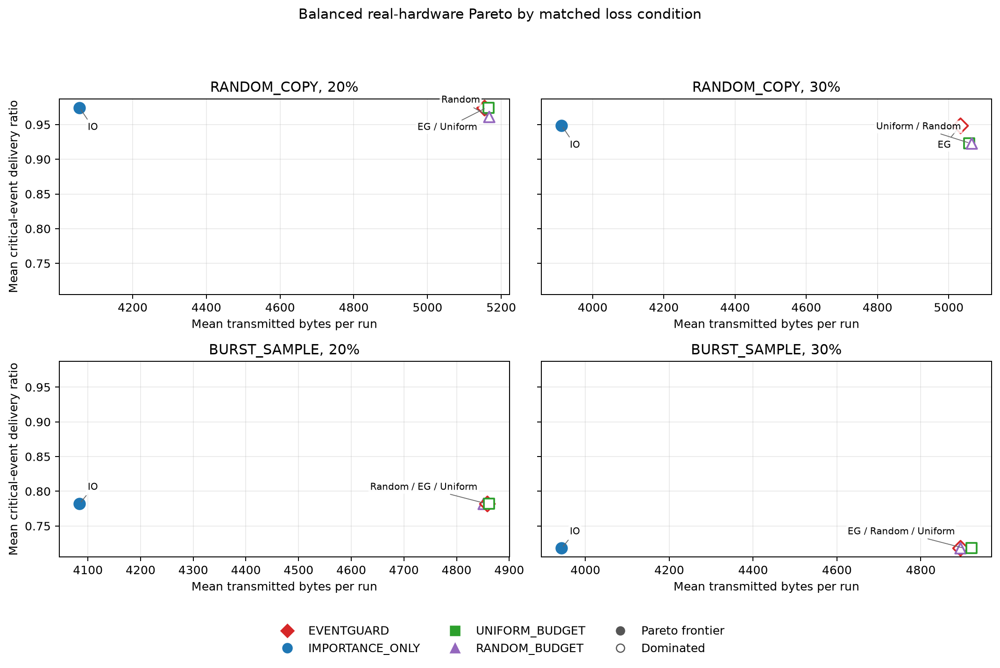

# Final hardware validation report

## Dataset and provenance

`FINAL_BALANCED_HARDWARE_SET_V1` is a post-hoc balanced primary analysis of the interrupted 160-run Stage 1 experiment: 96 completed runs from seeds 31–36, four strategies, two loss models, and 20%/30% application-layer loss. These are the earliest contiguous seeds with complete coverage in execution order; no seed was chosen based on treatment outcome. The n=6 sample size was not preregistered. Each seed has its own deterministic 54-sample trace realization, shared across strategies within that seed.

Analysis generated at UTC: `2026-09-26T15:19:22.324636+00:00`. Analysis Git commit: `80d3d1f26739e7d85a7e1c1f1399f1092c4a6e10`. Finalizer script SHA256: `703696c6e4ea58c7f58de1a177cc7620c7d527a1559b9ddedbad8ca6ee0a43ca`.

The runs used two ESP32-S3 boards and E220-400T22D radios. Firmware hashes are recorded per run in `selected_runs.json` and match the v2 smoke pair. The data are real hardware executions with software-injected loss; configured percentages are not measured RF packet-error rates.

A fresh offline audit passed every selected raw log and run manifest. It rechecked sample counts, END counters, UART_DIAG consistency, importance/copy/link replay, deterministic loss calendars, budget exactness, and metric recomputation. No selected run had an uncontrolled DATA or ACK loss, no policy divergence, and no sample delivery outcome differed from its frozen host reference.

## Statistical protocol

One seed/run pair is the statistical unit (`n=6` per condition). Summary rows report mean, median, sample standard deviation, and 95% t confidence interval. Paired comparisons use exact two-sided Wilcoxon signed-rank tests and rank-biserial effect size. P-values are unadjusted descriptive statistics and are not used for confirmatory significance claims. The CSV additionally reports Holm-adjusted p-values for the family of 12 critical-delivery comparisons; these too are exploratory. Interpretation emphasizes direction, magnitude, and paired consistency. The CSV reports all ties and non-ties.

## Main comparisons

Positive paired difference below means EVENTGUARD's metric is higher; for copy/byte/time metrics that means higher cost, not a strategy win. Delivery differences are fractions (0.01 = one percentage point). Counts are paired seeds where the metric is higher/equal/lower for EventGuard; exact p-values are coarse at n=6.

| Condition | Comparison | Critical delivery Δ (mean; median) | Wins/ties/losses | Exact p | Rank-biserial | DATA copies Δ | Total bytes Δ |
|---|---|---:|---:|---:|---:|---:|---:|
| RANDOM_COPY 20% | EG − IMPORTANCE_ONLY | 0.0000; 0.0000 | 0/6/0 | 1.0000 | 0.000 | 30.50 | 1098.5 |
| RANDOM_COPY 20% | EG − UNIFORM_BUDGET | 0.0000; 0.0000 | 0/6/0 | 1.0000 | 0.000 | 0.00 | -10.8 |
| RANDOM_COPY 20% | EG − RANDOM_BUDGET | 0.0128; 0.0000 | 1/5/0 | 1.0000 | 1.000 | 0.00 | -13.0 |
| RANDOM_COPY 30% | EG − IMPORTANCE_ONLY | 0.0000; 0.0000 | 0/6/0 | 1.0000 | 0.000 | 33.00 | 1120.2 |
| RANDOM_COPY 30% | EG − UNIFORM_BUDGET | 0.0256; 0.0000 | 2/4/0 | 0.5000 | 1.000 | 0.00 | -23.8 |
| RANDOM_COPY 30% | EG − RANDOM_BUDGET | 0.0256; 0.0000 | 2/4/0 | 0.5000 | 1.000 | 0.00 | -30.3 |
| BURST_SAMPLE 20% | EG − IMPORTANCE_ONLY | 0.0000; 0.0000 | 0/6/0 | 1.0000 | 0.000 | 21.17 | 773.5 |
| BURST_SAMPLE 20% | EG − UNIFORM_BUDGET | 0.0000; 0.0000 | 0/6/0 | 1.0000 | 0.000 | 0.00 | -4.3 |
| BURST_SAMPLE 20% | EG − RANDOM_BUDGET | 0.0000; 0.0000 | 0/6/0 | 1.0000 | 0.000 | 0.00 | 6.5 |
| BURST_SAMPLE 30% | EG − IMPORTANCE_ONLY | 0.0000; 0.0000 | 0/6/0 | 1.0000 | 0.000 | 27.17 | 951.2 |
| BURST_SAMPLE 30% | EG − UNIFORM_BUDGET | 0.0000; 0.0000 | 0/6/0 | 1.0000 | 0.000 | 0.00 | -26.0 |
| BURST_SAMPLE 30% | EG − RANDOM_BUDGET | 0.0000; 0.0000 | 0/6/0 | 1.0000 | 0.000 | 0.00 | 0.0 |

## Q1: EventGuard vs Importance Only

Critical-event delivery is exactly tied between EVENTGUARD and IMPORTANCE_ONLY in all six paired seeds in all four conditions (0/6/0 higher/equal/lower). Importance Only therefore retains the observed critical-delivery result with lower cost in this dataset. EventGuard sends an additional mean 30.50, 33.00, 21.17, and 27.17 DATA copies in RANDOM_COPY 20%, RANDOM_COPY 30%, BURST_SAMPLE 20%, and BURST_SAMPLE 30%, respectively. Its corresponding additional total bytes are 1,098.5, 1,120.2, 773.5, and 951.2 bytes per run. These are consistent cost increases, not extra critical-event delivery. The evaluated link adaptation does not add critical-delivery benefit under these tested conditions.

## Q2: Exact DATA-copy budget

UNIFORM_BUDGET and RANDOM_BUDGET match EventGuard's host-reference DATA-copy count exactly in every seed and condition. Against UNIFORM_BUDGET, EventGuard ties critical delivery in all six seeds for three conditions; at RANDOM_COPY 30%, it is higher in two seeds and tied in four, with mean paired gain 0.0256 and no losses (exact p=0.500). Against RANDOM_BUDGET, EventGuard has mean gains of 0.0128 at RANDOM_COPY 20% (one higher, five tied) and 0.0256 at RANDOM_COPY 30% (two higher, four tied); it ties all six seeds in both BURST_SAMPLE conditions. With n=6, these are small-sample directional observations, not definitive evidence of general superiority. Equal DATA-copy counts are exact; ACK activity can make total transmitted bytes differ.

Retrospective allocation analysis confirms EventGuard placed a larger fraction of its DATA traffic on ground-truth CRITICAL samples than either event-blind budget baseline in all four conditions. Ground-truth labels are used only for this post-run metric and were not available to either budget allocator:

- RANDOM_COPY 20%: EventGuard 27.4%; Uniform Budget 23.0%; Random Budget 24.1%; Importance Only 34.8%.
- RANDOM_COPY 30%: EventGuard 26.9%; Uniform Budget 24.0%; Random Budget 24.0%; Importance Only 34.8%.
- BURST_SAMPLE 20%: EventGuard 29.3%; Uniform Budget 21.1%; Random Budget 23.9%; Importance Only 34.8%.
- BURST_SAMPLE 30%: EventGuard 28.1%; Uniform Budget 22.7%; Random Budget 23.9%; Importance Only 34.8%.

## Q3: Burst-sample loss

Under BURST_SAMPLE, all four strategies have identical mean critical delivery within each tested rate: 0.7821 at 20% and 0.7179 at 30%. EventGuard and each budget baseline are paired ties in all six seeds. This supports the expected property of this deterministic model: when every copy opportunity for a logical sample is erased together, extra copies of that same sample cannot recover it. It does not establish that redundancy is ineffective for all real burst channels.

## Pareto analysis

The plots use per-condition mean critical-event delivery versus mean DATA copies and total bytes. A strategy is marked on the empirical frontier if no observed strategy has both lower/equal cost and higher/equal critical delivery with one strict improvement. This is a descriptive frontier over four treatment means, not a confidence region.

- EventGuard frontier appearances: 0/4 by DATA copies; 0/4 by bytes.
- Importance Only frontier appearances: 4/4 by DATA copies; 4/4 by bytes.

## Host simulation agreement

The selected set has 0 importance/copy/link replay divergences and 0 per-sample delivery outcome differences. The comparison CSV reports per-strategy host/hardware means, matched paired contrasts, and strategy ranking by condition. This is strong execution-level agreement for the tested deterministic setup; it does not establish agreement under uncontrolled RF fading, interference, range changes, or other hardware.

## Engineering anomaly outside the primary set

In a later extension run, one low-frequency ACK receive-path stall was observed at seed 37. The incomplete run 103 (`UNIFORM_BUDGET / RANDOM_COPY / 30% / seed37`) and its raw logs/diagnosis remain preserved and excluded from the balanced paired dataset. The root cause is unconfirmed and this report does not claim it was fixed.

## Interpretation and limitations

The most defensible contribution is event-importance-aware redundancy allocation for critical IoT events, evaluated against exact-budget event-blind allocations. In RANDOM_COPY 30%, EventGuard's mean critical-delivery advantage over both equal-budget baselines is 0.0256, but it occurs in only two of six paired seeds and is tied in the other four. At the other random-loss condition and under both burst conditions, gains are absent or smaller. Link adaptation is an evaluated ablation component and did not improve critical delivery over Importance Only in any tested paired seed; it increased resource use.

The study uses six paired seeds, one ESP32-S3 pair, a short synthetic trace, and deterministic application-layer erasures. It does not measure RF packet-error rate, range, interference robustness, power, or true RF airtime. Reported communication time is a UART serialization proxy, not measured PHY airtime; no Joule energy claim is made.

## Reproducibility artifacts

- `selected_runs.json`: exact run IDs, execution order, hashes, and inclusion rationale.
- `audit_report.md` and `audit_runs.csv`: offline checker results.
- `summary.csv`: per-strategy descriptive statistics.
- `paired_tests.csv`: balanced-subset paired comparisons, with descriptive raw p-values and Holm-adjusted critical-delivery p-values.
- `simulation_hardware_comparison.csv`: host/hardware means, paired differences, and rankings.
- `pareto_points.csv` and `plots/`: condition-wise Pareto points and figures.

There were 0 uncontrolled physical DATA misses and 0 uncontrolled physical ACK misses among the selected 96 runs.
