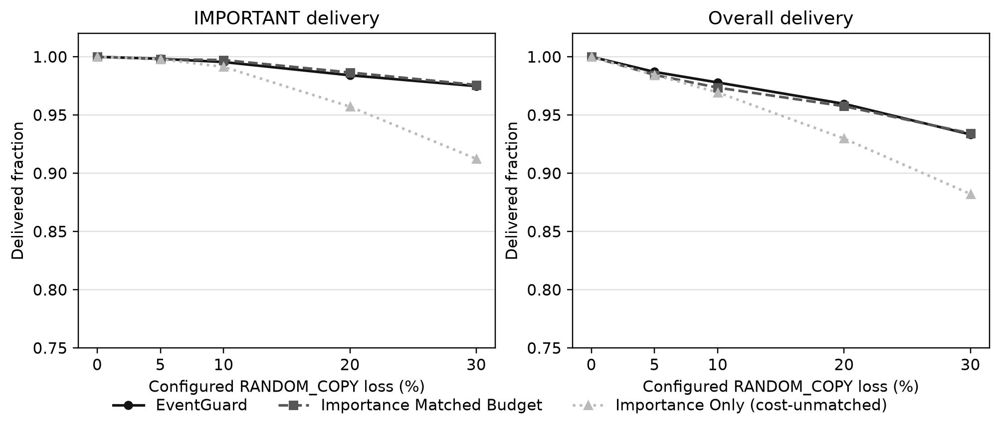
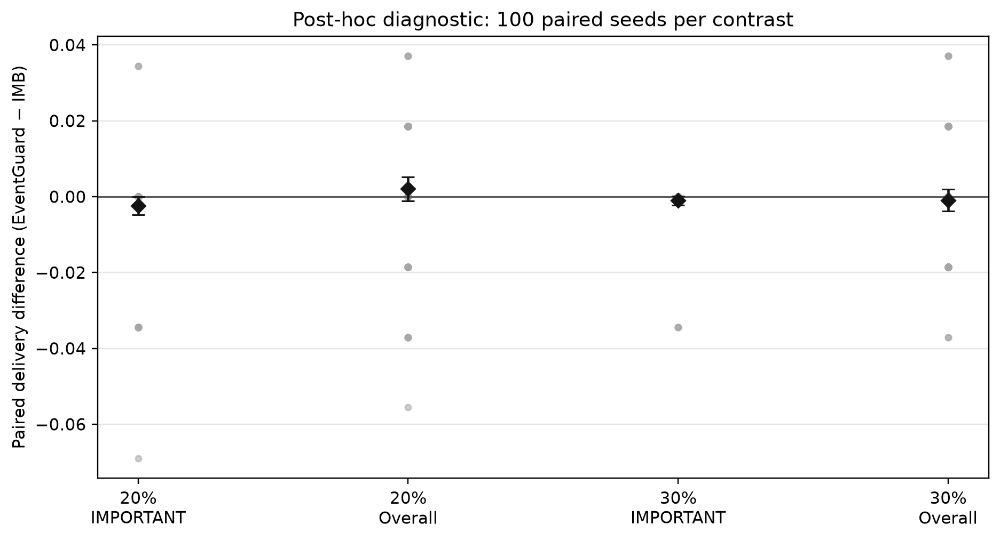

# Post-hoc importance-matched-budget host diagnostic

## 1. Question

At an exact DATA-copy budget, does EventGuard's link-state-aware copy placement outperform the specified importance-aware, link-blind counterfactual on IMPORTANT or overall delivery?

## 2. Why the existing comparison is confounded

EventGuard uses more DATA copies than Importance Only while also using link state. Their IMPORTANT/overall difference cannot be assigned specifically to placement without matching that budget.

## 3. Post-hoc status

This protocol was fixed after inspection of frozen v1 results and before producing the new IMB outcomes. It is not preregistered, not part of the original 8,000-run matrix, and not part of v1.0.0. These results are exploratory.

## 4. Baseline definition

IMB starts with predicted NORMAL/IMPORTANT/CRITICAL copies of 1/2/3, spends EventGuard's frozen realized extra DATA-copy budget on IMPORTANT first, then NORMAL in two headroom rounds, using only seeded SHA-256 order within a class. The allocator takes predicted classes, budget, and seed only. It does not read link state, ACK history, ground truth, sensor severity, calendar outcomes, or future delivery. It is an offline counterfactual rather than a deployable advance budget predictor.

## 5. Frozen inputs reused

The experiment uses `RANDOM_COPY`, rates 0/5/10/20/30%, seeds 31–130, the unchanged 54-sample trace generator, classifier, canonical DATA/ACK calendar, and the 500 preserved EventGuard reference rows in `results/pre_hardware_v1/runs.csv` (SHA-256 `959d7bacc3409edc520a2e2bb8ce22ce714b36bee31e1b0ba018daf9ec6ce3a8`). Exactly 500 new IMB runs were generated.

## 6. Exact-budget validation

All 500 pairs passed exact DATA-copy budget, trace hash, and canonical calendar identifier checks. All 500 frozen Importance Only consistency replays matched its saved delivery/cost fields; these are checks, not additional study runs. Matching DATA copies does not imply equal ACK frames or total bytes.

## 7. Primary diagnostic results

Each row is 100 paired seeds. Differences are EventGuard minus IMB in delivery-ratio units. CI is the repository's two-sided 95% paired-mean interval. Exact conditional signed-rank p-values and Holm values form a separate four-test post-hoc family and are exploratory descriptors.

| Rate | KPI | EG mean | IMB mean | Paired mean [95% CI] | Median | SD | W/T/L | n nonzero | p | Holm p | Rank-biserial |
|---|---|---:|---:|---:|---:|---:|---:|---:|---:|---:|---:|
| 20% | IMPORTANT | 0.9841 | 0.9866 | -0.00241 [-0.00482, -0.00001] | +0.0000 | 0.0123 | 2/90/8 | 10 | 0.091797 | 0.36719 | -0.636 |
| 20% | Overall | 0.9596 | 0.9576 | +0.00204 [-0.00110, +0.00517] | +0.0000 | 0.0160 | 30/54/16 | 46 | 0.18907 | 0.56722 | +0.207 |
| 30% | IMPORTANT | 0.9748 | 0.9759 | -0.00103 [-0.00219, +0.00012] | +0.0000 | 0.0059 | 0/97/3 | 3 | 0.25 | 0.56722 | -1.000 |
| 30% | Overall | 0.9333 | 0.9343 | -0.00093 [-0.00382, +0.00196] | +0.0000 | 0.0147 | 21/52/27 | 48 | 0.60597 | 0.60597 | -0.092 |

## 8. Secondary and descriptive results

The 0/5/10% conditions and CRITICAL/cost endpoints are descriptive only; full mean, median, SD and 95% CI rows are in `summary.csv`.

| Rate | EG − IMB CRITICAL delivery | EG / IMB DATA copies | EG − IMB ACK frames | EG − IMB total bytes |
|---|---:|---:|---:|---:|
| 0% | +0.0000 | 112.00 / 112.00 | +0.00 | +0.0 |
| 5% | +0.0000 | 116.45 / 116.45 | +0.02 | +0.3 |
| 10% | +0.0000 | 127.83 / 127.83 | +0.01 | +0.1 |
| 20% | +0.0000 | 140.68 / 140.68 | -0.06 | -0.8 |
| 30% | +0.0000 | 142.65 / 142.65 | -0.02 | -0.3 |

The IMB run records also include retrospective ground-truth CRITICAL/IMPORTANT traffic shares and predicted-class copy totals. The frozen v1 CSV does not retain IMPORTANT traffic share, so it is not reconstructed for EventGuard or Importance Only.

## 9. Interpretation

- RC20: EventGuard versus IMB IMPORTANT paired mean -0.0024 (2/90/8 W/T/L); overall +0.0020 (30/54/16 W/T/L).
- RC30: EventGuard versus IMB IMPORTANT paired mean -0.0010 (0/97/3 W/T/L); overall -0.0009 (21/52/27 W/T/L).

The four primary contrasts have mixed directions; the relative contribution of extra budget and this link-aware placement is condition- and KPI-dependent.

The previous EventGuard-versus-Importance-Only secondary gains are largely reproduced by IMB at the same EventGuard DATA-copy budget. The following mean uplifts over the cost-unmatched Importance Only reference show how much of each earlier gain this specified link-blind allocator retains:

| Rate | KPI | EG − IO | IMB − IO | EG − IMB |
|---|---|---:|---:|---:|
| 20% | IMPORTANT | +0.0269 | +0.0293 | -0.0024 |
| 20% | Overall | +0.0298 | +0.0278 | +0.0020 |
| 30% | IMPORTANT | +0.0624 | +0.0634 | -0.0010 |
| 30% | Overall | +0.0511 | +0.0520 | -0.0009 |

**Answers to the diagnostic questions.** IMB's mean IMPORTANT delivery exceeds EventGuard's at both 20% and 30%. EventGuard's mean overall delivery is slightly higher than IMB's at 20% and slightly lower at 30%. Across all four comparisons, the IMB-minus-Importance-Only uplift is close to the prior EventGuard-minus-Importance-Only uplift. Thus extra DATA-copy budget spent with importance information is a plausible main explanation; these host results do not show a consistent incremental advantage for EventGuard's link-aware placement over this specific IMB rule. This is a descriptive mechanism comparison, not a causal decomposition of every possible allocator.

At 20% IMPORTANT delivery, the paired-mean t interval narrowly lies below zero while the exact signed-rank p-value is 0.0918 and Holm-adjusted p-value is 0.3672; 90 of 100 pairs tie. These exploratory summaries use different assumptions and do not support a confirmatory claim.

## 10. What this does NOT establish

This host-only result does not validate E220 RF channel prediction, fading response, interference tolerance, range, or universal IoT reliability. It isolates placement relative to one fixed link-blind allocator, not every possible importance-aware allocator. P-values are exploratory, not confirmatory proof.

## 11. Hardware follow-up decision left open

No hardware experiment is performed or authorized by this report. Review the host diagnostic before deciding whether a new, separately scoped hardware comparison is warranted.
